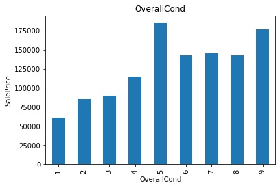
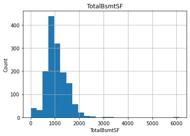
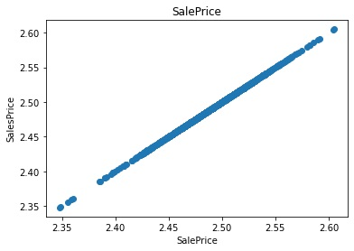
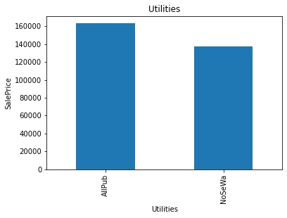
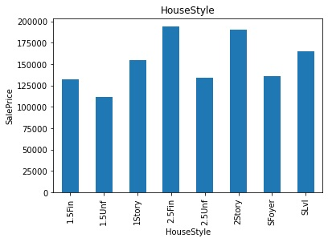
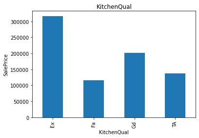

## Machine Learning Pipelines: House Prices
 #### Problem Statement:   
 To predict the house price based on various features.     
 https://www.kaggle.com/c/house-prices-advanced-regression-techniques  
      
      
 #### DateSet:   
 https://www.kaggle.com/c/house-prices-advanced-regression-techniques/data  
     

### LifeCycle In A Datascience Project  
1. [Data Analysis  ](https://github.com/sabdha/MachineLearningPipeline-AdvancedHouse_PricePrediction/blob/main/README.md#data-analysis)
2. [Feature Engineering  ](https://github.com/sabdha/MachineLearningPipeline-AdvancedHouse_PricePrediction/blob/main/README.md#feature-engineering)
3. Feature Selection  
4. Model Building  
5. MOdel Deployment  

### Data Analysis  


```python
import pandas as pd
import numpy as np
import matplotlib.pyplot as plt
%matplotlib inline
import seaborn as sns

##Display all the columns of the dataframe
pd.pandas.set_option('display.max_columns', None)
```


```python
dataset = pd.read_csv('C:/Users/dhany/Desktop/Housing_data/house-prices-advanced-regression-techniques/train.csv')
print(dataset.shape)
```

    (1460, 81)
    


```python
dataset.head()
```


<div>
<style scoped>
    .dataframe tbody tr th:only-of-type {
        vertical-align: middle;
    }

    .dataframe tbody tr th {
        vertical-align: top;
    }

    .dataframe thead th {
        text-align: right;
    }
</style>
<table border="1" class="dataframe">
  <thead>
    <tr style="text-align: right;">
      <th></th>
      <th>Id</th>
      <th>MSSubClass</th>
      <th>MSZoning</th>
      <th>LotFrontage</th>
      <th>LotArea</th>
      <th>Street</th>
      <th>Alley</th>
      <th>LotShape</th>
      <th>LandContour</th>
      <th>Utilities</th>
      <th>LotConfig</th>
      <th>LandSlope</th>
      <th>Neighborhood</th>
      <th>Condition1</th>
      <th>Condition2</th>
      <th>BldgType</th>
      <th>HouseStyle</th>
      <th>OverallQual</th>
      <th>OverallCond</th>
      <th>YearBuilt</th>
      <th>YearRemodAdd</th>
      <th>RoofStyle</th>
      <th>RoofMatl</th>
      <th>Exterior1st</th>
      <th>Exterior2nd</th>
      <th>MasVnrType</th>
      <th>MasVnrArea</th>
      <th>ExterQual</th>
      <th>ExterCond</th>
      <th>Foundation</th>
      <th>BsmtQual</th>
      <th>BsmtCond</th>
      <th>BsmtExposure</th>
      <th>BsmtFinType1</th>
      <th>BsmtFinSF1</th>
      <th>BsmtFinType2</th>
      <th>BsmtFinSF2</th>
      <th>BsmtUnfSF</th>
      <th>TotalBsmtSF</th>
      <th>Heating</th>
      <th>HeatingQC</th>
      <th>CentralAir</th>
      <th>Electrical</th>
      <th>1stFlrSF</th>
      <th>2ndFlrSF</th>
      <th>LowQualFinSF</th>
      <th>GrLivArea</th>
      <th>BsmtFullBath</th>
      <th>BsmtHalfBath</th>
      <th>FullBath</th>
      <th>HalfBath</th>
      <th>BedroomAbvGr</th>
      <th>KitchenAbvGr</th>
      <th>KitchenQual</th>
      <th>TotRmsAbvGrd</th>
      <th>Functional</th>
      <th>Fireplaces</th>
      <th>FireplaceQu</th>
      <th>GarageType</th>
      <th>GarageYrBlt</th>
      <th>GarageFinish</th>
      <th>GarageCars</th>
      <th>GarageArea</th>
      <th>GarageQual</th>
      <th>GarageCond</th>
      <th>PavedDrive</th>
      <th>WoodDeckSF</th>
      <th>OpenPorchSF</th>
      <th>EnclosedPorch</th>
      <th>3SsnPorch</th>
      <th>ScreenPorch</th>
      <th>PoolArea</th>
      <th>PoolQC</th>
      <th>Fence</th>
      <th>MiscFeature</th>
      <th>MiscVal</th>
      <th>MoSold</th>
      <th>YrSold</th>
      <th>SaleType</th>
      <th>SaleCondition</th>
      <th>SalePrice</th>
    </tr>
  </thead>
  <tbody>
    <tr>
      <th>0</th>
      <td>1</td>
      <td>60</td>
      <td>RL</td>
      <td>65.0</td>
      <td>8450</td>
      <td>Pave</td>
      <td>NaN</td>
      <td>Reg</td>
      <td>Lvl</td>
      <td>AllPub</td>
      <td>Inside</td>
      <td>Gtl</td>
      <td>CollgCr</td>
      <td>Norm</td>
      <td>Norm</td>
      <td>1Fam</td>
      <td>2Story</td>
      <td>7</td>
      <td>5</td>
      <td>2003</td>
      <td>2003</td>
      <td>Gable</td>
      <td>CompShg</td>
      <td>VinylSd</td>
      <td>VinylSd</td>
      <td>BrkFace</td>
      <td>196.0</td>
      <td>Gd</td>
      <td>TA</td>
      <td>PConc</td>
      <td>Gd</td>
      <td>TA</td>
      <td>No</td>
      <td>GLQ</td>
      <td>706</td>
      <td>Unf</td>
      <td>0</td>
      <td>150</td>
      <td>856</td>
      <td>GasA</td>
      <td>Ex</td>
      <td>Y</td>
      <td>SBrkr</td>
      <td>856</td>
      <td>854</td>
      <td>0</td>
      <td>1710</td>
      <td>1</td>
      <td>0</td>
      <td>2</td>
      <td>1</td>
      <td>3</td>
      <td>1</td>
      <td>Gd</td>
      <td>8</td>
      <td>Typ</td>
      <td>0</td>
      <td>NaN</td>
      <td>Attchd</td>
      <td>2003.0</td>
      <td>RFn</td>
      <td>2</td>
      <td>548</td>
      <td>TA</td>
      <td>TA</td>
      <td>Y</td>
      <td>0</td>
      <td>61</td>
      <td>0</td>
      <td>0</td>
      <td>0</td>
      <td>0</td>
      <td>NaN</td>
      <td>NaN</td>
      <td>NaN</td>
      <td>0</td>
      <td>2</td>
      <td>2008</td>
      <td>WD</td>
      <td>Normal</td>
      <td>208500</td>
    </tr>
    <tr>
      <th>1</th>
      <td>2</td>
      <td>20</td>
      <td>RL</td>
      <td>80.0</td>
      <td>9600</td>
      <td>Pave</td>
      <td>NaN</td>
      <td>Reg</td>
      <td>Lvl</td>
      <td>AllPub</td>
      <td>FR2</td>
      <td>Gtl</td>
      <td>Veenker</td>
      <td>Feedr</td>
      <td>Norm</td>
      <td>1Fam</td>
      <td>1Story</td>
      <td>6</td>
      <td>8</td>
      <td>1976</td>
      <td>1976</td>
      <td>Gable</td>
      <td>CompShg</td>
      <td>MetalSd</td>
      <td>MetalSd</td>
      <td>None</td>
      <td>0.0</td>
      <td>TA</td>
      <td>TA</td>
      <td>CBlock</td>
      <td>Gd</td>
      <td>TA</td>
      <td>Gd</td>
      <td>ALQ</td>
      <td>978</td>
      <td>Unf</td>
      <td>0</td>
      <td>284</td>
      <td>1262</td>
      <td>GasA</td>
      <td>Ex</td>
      <td>Y</td>
      <td>SBrkr</td>
      <td>1262</td>
      <td>0</td>
      <td>0</td>
      <td>1262</td>
      <td>0</td>
      <td>1</td>
      <td>2</td>
      <td>0</td>
      <td>3</td>
      <td>1</td>
      <td>TA</td>
      <td>6</td>
      <td>Typ</td>
      <td>1</td>
      <td>TA</td>
      <td>Attchd</td>
      <td>1976.0</td>
      <td>RFn</td>
      <td>2</td>
      <td>460</td>
      <td>TA</td>
      <td>TA</td>
      <td>Y</td>
      <td>298</td>
      <td>0</td>
      <td>0</td>
      <td>0</td>
      <td>0</td>
      <td>0</td>
      <td>NaN</td>
      <td>NaN</td>
      <td>NaN</td>
      <td>0</td>
      <td>5</td>
      <td>2007</td>
      <td>WD</td>
      <td>Normal</td>
      <td>181500</td>
    </tr>
    <tr>
      <th>2</th>
      <td>3</td>
      <td>60</td>
      <td>RL</td>
      <td>68.0</td>
      <td>11250</td>
      <td>Pave</td>
      <td>NaN</td>
      <td>IR1</td>
      <td>Lvl</td>
      <td>AllPub</td>
      <td>Inside</td>
      <td>Gtl</td>
      <td>CollgCr</td>
      <td>Norm</td>
      <td>Norm</td>
      <td>1Fam</td>
      <td>2Story</td>
      <td>7</td>
      <td>5</td>
      <td>2001</td>
      <td>2002</td>
      <td>Gable</td>
      <td>CompShg</td>
      <td>VinylSd</td>
      <td>VinylSd</td>
      <td>BrkFace</td>
      <td>162.0</td>
      <td>Gd</td>
      <td>TA</td>
      <td>PConc</td>
      <td>Gd</td>
      <td>TA</td>
      <td>Mn</td>
      <td>GLQ</td>
      <td>486</td>
      <td>Unf</td>
      <td>0</td>
      <td>434</td>
      <td>920</td>
      <td>GasA</td>
      <td>Ex</td>
      <td>Y</td>
      <td>SBrkr</td>
      <td>920</td>
      <td>866</td>
      <td>0</td>
      <td>1786</td>
      <td>1</td>
      <td>0</td>
      <td>2</td>
      <td>1</td>
      <td>3</td>
      <td>1</td>
      <td>Gd</td>
      <td>6</td>
      <td>Typ</td>
      <td>1</td>
      <td>TA</td>
      <td>Attchd</td>
      <td>2001.0</td>
      <td>RFn</td>
      <td>2</td>
      <td>608</td>
      <td>TA</td>
      <td>TA</td>
      <td>Y</td>
      <td>0</td>
      <td>42</td>
      <td>0</td>
      <td>0</td>
      <td>0</td>
      <td>0</td>
      <td>NaN</td>
      <td>NaN</td>
      <td>NaN</td>
      <td>0</td>
      <td>9</td>
      <td>2008</td>
      <td>WD</td>
      <td>Normal</td>
      <td>223500</td>
    </tr>
    <tr>
      <th>3</th>
      <td>4</td>
      <td>70</td>
      <td>RL</td>
      <td>60.0</td>
      <td>9550</td>
      <td>Pave</td>
      <td>NaN</td>
      <td>IR1</td>
      <td>Lvl</td>
      <td>AllPub</td>
      <td>Corner</td>
      <td>Gtl</td>
      <td>Crawfor</td>
      <td>Norm</td>
      <td>Norm</td>
      <td>1Fam</td>
      <td>2Story</td>
      <td>7</td>
      <td>5</td>
      <td>1915</td>
      <td>1970</td>
      <td>Gable</td>
      <td>CompShg</td>
      <td>Wd Sdng</td>
      <td>Wd Shng</td>
      <td>None</td>
      <td>0.0</td>
      <td>TA</td>
      <td>TA</td>
      <td>BrkTil</td>
      <td>TA</td>
      <td>Gd</td>
      <td>No</td>
      <td>ALQ</td>
      <td>216</td>
      <td>Unf</td>
      <td>0</td>
      <td>540</td>
      <td>756</td>
      <td>GasA</td>
      <td>Gd</td>
      <td>Y</td>
      <td>SBrkr</td>
      <td>961</td>
      <td>756</td>
      <td>0</td>
      <td>1717</td>
      <td>1</td>
      <td>0</td>
      <td>1</td>
      <td>0</td>
      <td>3</td>
      <td>1</td>
      <td>Gd</td>
      <td>7</td>
      <td>Typ</td>
      <td>1</td>
      <td>Gd</td>
      <td>Detchd</td>
      <td>1998.0</td>
      <td>Unf</td>
      <td>3</td>
      <td>642</td>
      <td>TA</td>
      <td>TA</td>
      <td>Y</td>
      <td>0</td>
      <td>35</td>
      <td>272</td>
      <td>0</td>
      <td>0</td>
      <td>0</td>
      <td>NaN</td>
      <td>NaN</td>
      <td>NaN</td>
      <td>0</td>
      <td>2</td>
      <td>2006</td>
      <td>WD</td>
      <td>Abnorml</td>
      <td>140000</td>
    </tr>
    <tr>
      <th>4</th>
      <td>5</td>
      <td>60</td>
      <td>RL</td>
      <td>84.0</td>
      <td>14260</td>
      <td>Pave</td>
      <td>NaN</td>
      <td>IR1</td>
      <td>Lvl</td>
      <td>AllPub</td>
      <td>FR2</td>
      <td>Gtl</td>
      <td>NoRidge</td>
      <td>Norm</td>
      <td>Norm</td>
      <td>1Fam</td>
      <td>2Story</td>
      <td>8</td>
      <td>5</td>
      <td>2000</td>
      <td>2000</td>
      <td>Gable</td>
      <td>CompShg</td>
      <td>VinylSd</td>
      <td>VinylSd</td>
      <td>BrkFace</td>
      <td>350.0</td>
      <td>Gd</td>
      <td>TA</td>
      <td>PConc</td>
      <td>Gd</td>
      <td>TA</td>
      <td>Av</td>
      <td>GLQ</td>
      <td>655</td>
      <td>Unf</td>
      <td>0</td>
      <td>490</td>
      <td>1145</td>
      <td>GasA</td>
      <td>Ex</td>
      <td>Y</td>
      <td>SBrkr</td>
      <td>1145</td>
      <td>1053</td>
      <td>0</td>
      <td>2198</td>
      <td>1</td>
      <td>0</td>
      <td>2</td>
      <td>1</td>
      <td>4</td>
      <td>1</td>
      <td>Gd</td>
      <td>9</td>
      <td>Typ</td>
      <td>1</td>
      <td>TA</td>
      <td>Attchd</td>
      <td>2000.0</td>
      <td>RFn</td>
      <td>3</td>
      <td>836</td>
      <td>TA</td>
      <td>TA</td>
      <td>Y</td>
      <td>192</td>
      <td>84</td>
      <td>0</td>
      <td>0</td>
      <td>0</td>
      <td>0</td>
      <td>NaN</td>
      <td>NaN</td>
      <td>NaN</td>
      <td>0</td>
      <td>12</td>
      <td>2008</td>
      <td>WD</td>
      <td>Normal</td>
      <td>250000</td>
    </tr>
  </tbody>
</table>
</div>


#### Analyzing the following factors:  
1. Missing Values  
2. All the Numerical Variables  
3. Distribution of the Numerical Variables  
4. Categorical Variables  
5. Cardinality of Categorical Variables  
6. Outliers  
7. Relationship between the independent and dependent feature(Sales Price)  

### Missing Values:  
Here we will check how many missing values(percentage) are present in each feature .   
step 1: Make the list of features which has the missing values.    
step2: Print the feature name and the percentage of missing values.  


```python
features_na = [features for features in dataset.columns if dataset[features].isnull().sum()>1]
for feature in features_na:
    print(feature, np.round(dataset[feature].isnull().mean(),4), '%missing values')
```

    LotFrontage 0.1774 %missing values
    Alley 0.9377 %missing values
    MasVnrType 0.0055 %missing values
    MasVnrArea 0.0055 %missing values
    BsmtQual 0.0253 %missing values
    BsmtCond 0.0253 %missing values
    BsmtExposure 0.026 %missing values
    BsmtFinType1 0.0253 %missing values
    BsmtFinType2 0.026 %missing values
    FireplaceQu 0.4726 %missing values
    GarageType 0.0555 %missing values
    GarageYrBlt 0.0555 %missing values
    GarageFinish 0.0555 %missing values
    GarageQual 0.0555 %missing values
    GarageCond 0.0555 %missing values
    PoolQC 0.9952 %missing values
    Fence 0.8075 %missing values
    MiscFeature 0.963 %missing values
    

To check the impact of missing value i.e. if the sales price is going up or decreasing depending on the missing value,
we will plot these count of missing values for each feature against the sales price.


```python
for feature in features_na:
    data = dataset.copy()

    # 1 indicates Missing value is present and zero indicates no Missing value
    data[feature] = np.where(data[feature].isnull(),1,0)
    
    #let's calculate the mean saleprice where the information is missing or present
    data.groupby(feature)['SalePrice'].median().plot.bar()
    plt.title(feature)
    plt.show()
```


    

    


    

    


    

    


    

    


    

    


    

    


    

    


    

    


    

    


    

    


    

    


    

    


    

    


    

    


    

    


    

    


    

    


    

    


In LotFrontage and other features, with the NaN value, the house price is showing high mean Sales price. So we need to replace these missing values and this will be done in the feature Engineering part.

In the dataset there is a feature called id, which is unique. So we dont need this feature.  
Lets print and see the number of ids.  


```python
print("Id:{}".format(len(dataset.Id)))
```

    Id:1460
    

### Numerical Variables  
The numerical variables or features in the dataset is determined below.  


```python
#The O represents an object variable. Determining the variables which are not Object is done below.
numerical_features = [feature for feature in dataset.columns if dataset[feature].dtypes != 'O']
print(len(numerical_features))
dataset[numerical_features].head()
```

    38
    


<div>
<style scoped>
    .dataframe tbody tr th:only-of-type {
        vertical-align: middle;
    }

    .dataframe tbody tr th {
        vertical-align: top;
    }

    .dataframe thead th {
        text-align: right;
    }
</style>
<table border="1" class="dataframe">
  <thead>
    <tr style="text-align: right;">
      <th></th>
      <th>Id</th>
      <th>MSSubClass</th>
      <th>LotFrontage</th>
      <th>LotArea</th>
      <th>OverallQual</th>
      <th>OverallCond</th>
      <th>YearBuilt</th>
      <th>YearRemodAdd</th>
      <th>MasVnrArea</th>
      <th>BsmtFinSF1</th>
      <th>BsmtFinSF2</th>
      <th>BsmtUnfSF</th>
      <th>TotalBsmtSF</th>
      <th>1stFlrSF</th>
      <th>2ndFlrSF</th>
      <th>LowQualFinSF</th>
      <th>GrLivArea</th>
      <th>BsmtFullBath</th>
      <th>BsmtHalfBath</th>
      <th>FullBath</th>
      <th>HalfBath</th>
      <th>BedroomAbvGr</th>
      <th>KitchenAbvGr</th>
      <th>TotRmsAbvGrd</th>
      <th>Fireplaces</th>
      <th>GarageYrBlt</th>
      <th>GarageCars</th>
      <th>GarageArea</th>
      <th>WoodDeckSF</th>
      <th>OpenPorchSF</th>
      <th>EnclosedPorch</th>
      <th>3SsnPorch</th>
      <th>ScreenPorch</th>
      <th>PoolArea</th>
      <th>MiscVal</th>
      <th>MoSold</th>
      <th>YrSold</th>
      <th>SalePrice</th>
    </tr>
  </thead>
  <tbody>
    <tr>
      <th>0</th>
      <td>1</td>
      <td>60</td>
      <td>65.0</td>
      <td>8450</td>
      <td>7</td>
      <td>5</td>
      <td>2003</td>
      <td>2003</td>
      <td>196.0</td>
      <td>706</td>
      <td>0</td>
      <td>150</td>
      <td>856</td>
      <td>856</td>
      <td>854</td>
      <td>0</td>
      <td>1710</td>
      <td>1</td>
      <td>0</td>
      <td>2</td>
      <td>1</td>
      <td>3</td>
      <td>1</td>
      <td>8</td>
      <td>0</td>
      <td>2003.0</td>
      <td>2</td>
      <td>548</td>
      <td>0</td>
      <td>61</td>
      <td>0</td>
      <td>0</td>
      <td>0</td>
      <td>0</td>
      <td>0</td>
      <td>2</td>
      <td>2008</td>
      <td>208500</td>
    </tr>
    <tr>
      <th>1</th>
      <td>2</td>
      <td>20</td>
      <td>80.0</td>
      <td>9600</td>
      <td>6</td>
      <td>8</td>
      <td>1976</td>
      <td>1976</td>
      <td>0.0</td>
      <td>978</td>
      <td>0</td>
      <td>284</td>
      <td>1262</td>
      <td>1262</td>
      <td>0</td>
      <td>0</td>
      <td>1262</td>
      <td>0</td>
      <td>1</td>
      <td>2</td>
      <td>0</td>
      <td>3</td>
      <td>1</td>
      <td>6</td>
      <td>1</td>
      <td>1976.0</td>
      <td>2</td>
      <td>460</td>
      <td>298</td>
      <td>0</td>
      <td>0</td>
      <td>0</td>
      <td>0</td>
      <td>0</td>
      <td>0</td>
      <td>5</td>
      <td>2007</td>
      <td>181500</td>
    </tr>
    <tr>
      <th>2</th>
      <td>3</td>
      <td>60</td>
      <td>68.0</td>
      <td>11250</td>
      <td>7</td>
      <td>5</td>
      <td>2001</td>
      <td>2002</td>
      <td>162.0</td>
      <td>486</td>
      <td>0</td>
      <td>434</td>
      <td>920</td>
      <td>920</td>
      <td>866</td>
      <td>0</td>
      <td>1786</td>
      <td>1</td>
      <td>0</td>
      <td>2</td>
      <td>1</td>
      <td>3</td>
      <td>1</td>
      <td>6</td>
      <td>1</td>
      <td>2001.0</td>
      <td>2</td>
      <td>608</td>
      <td>0</td>
      <td>42</td>
      <td>0</td>
      <td>0</td>
      <td>0</td>
      <td>0</td>
      <td>0</td>
      <td>9</td>
      <td>2008</td>
      <td>223500</td>
    </tr>
    <tr>
      <th>3</th>
      <td>4</td>
      <td>70</td>
      <td>60.0</td>
      <td>9550</td>
      <td>7</td>
      <td>5</td>
      <td>1915</td>
      <td>1970</td>
      <td>0.0</td>
      <td>216</td>
      <td>0</td>
      <td>540</td>
      <td>756</td>
      <td>961</td>
      <td>756</td>
      <td>0</td>
      <td>1717</td>
      <td>1</td>
      <td>0</td>
      <td>1</td>
      <td>0</td>
      <td>3</td>
      <td>1</td>
      <td>7</td>
      <td>1</td>
      <td>1998.0</td>
      <td>3</td>
      <td>642</td>
      <td>0</td>
      <td>35</td>
      <td>272</td>
      <td>0</td>
      <td>0</td>
      <td>0</td>
      <td>0</td>
      <td>2</td>
      <td>2006</td>
      <td>140000</td>
    </tr>
    <tr>
      <th>4</th>
      <td>5</td>
      <td>60</td>
      <td>84.0</td>
      <td>14260</td>
      <td>8</td>
      <td>5</td>
      <td>2000</td>
      <td>2000</td>
      <td>350.0</td>
      <td>655</td>
      <td>0</td>
      <td>490</td>
      <td>1145</td>
      <td>1145</td>
      <td>1053</td>
      <td>0</td>
      <td>2198</td>
      <td>1</td>
      <td>0</td>
      <td>2</td>
      <td>1</td>
      <td>4</td>
      <td>1</td>
      <td>9</td>
      <td>1</td>
      <td>2000.0</td>
      <td>3</td>
      <td>836</td>
      <td>192</td>
      <td>84</td>
      <td>0</td>
      <td>0</td>
      <td>0</td>
      <td>0</td>
      <td>0</td>
      <td>12</td>
      <td>2008</td>
      <td>250000</td>
    </tr>
  </tbody>
</table>
</div>


### Temporal Variables(Date Time Variables)  
From the dataset we have 4 year variables. We can extract information number of years or number of days. Information like the year house was built and the year house was sold is one such important information.  


```python
year_feature = [feature for feature in numerical_features if 'Yr' in feature or 'Year' in feature ]
year_feature
```


    ['YearBuilt', 'YearRemodAdd', 'GarageYrBlt', 'YrSold']


```python
for feature in year_feature:
    print (feature, dataset[feature].unique())
```

    YearBuilt [2003 1976 2001 1915 2000 1993 2004 1973 1931 1939 1965 2005 1962 2006
     1960 1929 1970 1967 1958 1930 2002 1968 2007 1951 1957 1927 1920 1966
     1959 1994 1954 1953 1955 1983 1975 1997 1934 1963 1981 1964 1999 1972
     1921 1945 1982 1998 1956 1948 1910 1995 1991 2009 1950 1961 1977 1985
     1979 1885 1919 1990 1969 1935 1988 1971 1952 1936 1923 1924 1984 1926
     1940 1941 1987 1986 2008 1908 1892 1916 1932 1918 1912 1947 1925 1900
     1980 1989 1992 1949 1880 1928 1978 1922 1996 2010 1946 1913 1937 1942
     1938 1974 1893 1914 1906 1890 1898 1904 1882 1875 1911 1917 1872 1905]
    YearRemodAdd [2003 1976 2002 1970 2000 1995 2005 1973 1950 1965 2006 1962 2007 1960
     2001 1967 2004 2008 1997 1959 1990 1955 1983 1980 1966 1963 1987 1964
     1972 1996 1998 1989 1953 1956 1968 1981 1992 2009 1982 1961 1993 1999
     1985 1979 1977 1969 1958 1991 1971 1952 1975 2010 1984 1986 1994 1988
     1954 1957 1951 1978 1974]
    GarageYrBlt [2003. 1976. 2001. 1998. 2000. 1993. 2004. 1973. 1931. 1939. 1965. 2005.
     1962. 2006. 1960. 1991. 1970. 1967. 1958. 1930. 2002. 1968. 2007. 2008.
     1957. 1920. 1966. 1959. 1995. 1954. 1953.   nan 1983. 1977. 1997. 1985.
     1963. 1981. 1964. 1999. 1935. 1990. 1945. 1987. 1989. 1915. 1956. 1948.
     1974. 2009. 1950. 1961. 1921. 1900. 1979. 1951. 1969. 1936. 1975. 1971.
     1923. 1984. 1926. 1955. 1986. 1988. 1916. 1932. 1972. 1918. 1980. 1924.
     1996. 1940. 1949. 1994. 1910. 1978. 1982. 1992. 1925. 1941. 2010. 1927.
     1947. 1937. 1942. 1938. 1952. 1928. 1922. 1934. 1906. 1914. 1946. 1908.
     1929. 1933.]
    YrSold [2008 2007 2006 2009 2010]
    


```python
#Let us analyze Temporal Date Time variables.
#checking relation between Year built and Year sold.

dataset.groupby('YrSold')['SalePrice'].median().plot()
plt.xlabel('Year Sold')
plt.ylabel('Meadian House Price')
plt.title('House Price vs YearSold')
```


    Text(0.5, 1.0, 'House Price vs YearSold')


    

    


Here the price is seen decreasing. So we will find the problem with yearsold. We will compare the yearsold with other year features in the dataset.


```python
for feature in year_feature:
    if feature!= 'YrSold':
        data = dataset.copy()
        ## we will capture the difference between the year variable and year the house 
        data[feature] = data['YrSold']-data[feature]
        plt.scatter(data[feature], data['SalePrice'])
        plt.xlabel(feature)
        plt.ylabel('SalePrice')
        plt.show()
```


    

    


    

    


    

    


### Type of Numerical Variable- Discrete or Continuous  
The numerical variables are of two types. The discrete variables are those which has more than a threshold amount of unique values. Other wise it is a continuous variable. The continuous variable has other properties also like they should not be a part of year variables or id.

#### Discrete Variable


```python
discrete_features = [feature for feature in numerical_features if len(dataset[feature].unique())<25 and feature not in year_feature+['Id']]
print(len(discrete_features))
```

    17
    


```python
discrete_features
```


    ['MSSubClass',
     'OverallQual',
     'OverallCond',
     'LowQualFinSF',
     'BsmtFullBath',
     'BsmtHalfBath',
     'FullBath',
     'HalfBath',
     'BedroomAbvGr',
     'KitchenAbvGr',
     'TotRmsAbvGrd',
     'Fireplaces',
     'GarageCars',
     '3SsnPorch',
     'PoolArea',
     'MiscVal',
     'MoSold']


```python
dataset[discrete_features].head()
```


<div>
<style scoped>
    .dataframe tbody tr th:only-of-type {
        vertical-align: middle;
    }

    .dataframe tbody tr th {
        vertical-align: top;
    }

    .dataframe thead th {
        text-align: right;
    }
</style>
<table border="1" class="dataframe">
  <thead>
    <tr style="text-align: right;">
      <th></th>
      <th>MSSubClass</th>
      <th>OverallQual</th>
      <th>OverallCond</th>
      <th>LowQualFinSF</th>
      <th>BsmtFullBath</th>
      <th>BsmtHalfBath</th>
      <th>FullBath</th>
      <th>HalfBath</th>
      <th>BedroomAbvGr</th>
      <th>KitchenAbvGr</th>
      <th>TotRmsAbvGrd</th>
      <th>Fireplaces</th>
      <th>GarageCars</th>
      <th>3SsnPorch</th>
      <th>PoolArea</th>
      <th>MiscVal</th>
      <th>MoSold</th>
    </tr>
  </thead>
  <tbody>
    <tr>
      <th>0</th>
      <td>60</td>
      <td>7</td>
      <td>5</td>
      <td>0</td>
      <td>1</td>
      <td>0</td>
      <td>2</td>
      <td>1</td>
      <td>3</td>
      <td>1</td>
      <td>8</td>
      <td>0</td>
      <td>2</td>
      <td>0</td>
      <td>0</td>
      <td>0</td>
      <td>2</td>
    </tr>
    <tr>
      <th>1</th>
      <td>20</td>
      <td>6</td>
      <td>8</td>
      <td>0</td>
      <td>0</td>
      <td>1</td>
      <td>2</td>
      <td>0</td>
      <td>3</td>
      <td>1</td>
      <td>6</td>
      <td>1</td>
      <td>2</td>
      <td>0</td>
      <td>0</td>
      <td>0</td>
      <td>5</td>
    </tr>
    <tr>
      <th>2</th>
      <td>60</td>
      <td>7</td>
      <td>5</td>
      <td>0</td>
      <td>1</td>
      <td>0</td>
      <td>2</td>
      <td>1</td>
      <td>3</td>
      <td>1</td>
      <td>6</td>
      <td>1</td>
      <td>2</td>
      <td>0</td>
      <td>0</td>
      <td>0</td>
      <td>9</td>
    </tr>
    <tr>
      <th>3</th>
      <td>70</td>
      <td>7</td>
      <td>5</td>
      <td>0</td>
      <td>1</td>
      <td>0</td>
      <td>1</td>
      <td>0</td>
      <td>3</td>
      <td>1</td>
      <td>7</td>
      <td>1</td>
      <td>3</td>
      <td>0</td>
      <td>0</td>
      <td>0</td>
      <td>2</td>
    </tr>
    <tr>
      <th>4</th>
      <td>60</td>
      <td>8</td>
      <td>5</td>
      <td>0</td>
      <td>1</td>
      <td>0</td>
      <td>2</td>
      <td>1</td>
      <td>4</td>
      <td>1</td>
      <td>9</td>
      <td>1</td>
      <td>3</td>
      <td>0</td>
      <td>0</td>
      <td>0</td>
      <td>12</td>
    </tr>
  </tbody>
</table>
</div>


### RelationShip Between discrete values and SalesPrice


```python
for feature in discrete_features:
    data = dataset.copy()
    data.groupby(feature)['SalePrice'].median().plot.bar()
    plt.xlabel(feature)
    plt.ylabel('SalePrice')
    plt.title(feature)
    plt.show()
```


    

    


    

    


    

    


    

    


    

    


    

    


    

    


    

    


    

    


    

    


    

    


    

    


    

    


    

    


    

    


    

    


    

    


### Continuous Variable  
It shoud not be a part of discrete variables, year or id


```python
continuous_features = [feature for feature in numerical_features if feature not in discrete_features+year_feature+['Id']]
print(len(continuous_features))
```

    16
    


```python
##These are continous values. So we need to plot them in histograms
for feature in continuous_features:
    data = dataset.copy()
    data[feature].hist(bins = 25)
    plt.xlabel(feature)
    plt.ylabel('Count')
    plt.title(feature)
    plt.show()
```


    

    


    

    


    

    


    

    


    

    


    

    


    

    


    

    


    

    


    

    


    

    


    

    


    

    


    

    


    

    


    

    


Many features have skewed data when continuous variables are plotted.The logarithmic transformation will be performed on these features' data.We are going to apply log normal distribution.


```python
data['BsmtHalfBath'].unique()
```


    array([0, 1, 2], dtype=int64)


```python

for feature in continuous_features:
    data = dataset.copy()
#log 0 is undefined. It's not a real number, because you can never get zero by raising anything to the power of anything else. 
    if 0 in data[feature].unique():
        pass
    else:
        data[feature] = np.log(data[feature])#since there is skewness in the data distribution
        data['SalePrice'] = np.log(data['SalePrice'])#datadistribution is skewed
        plt.scatter(data[feature], data['SalePrice'])
        plt.xlabel(feature)
        plt.ylabel('SalesPrice')
        plt.title(feature)
        plt.show()
```


    

    


    

    


    

    


    

    


    

    


#### Outliers  
Next step is to find out the outliers present inthe data. They are extreme values, a very high or low value.


```python

for feature in continuous_features:
    data = dataset.copy()
    if 0 in data[feature].unique():
        pass
    else:
        data[feature] = np.log(data[feature])
        data.boxplot(column=feature)
        plt.ylabel(feature)
        plt.title(feature)
        plt.show()
```


    

    


    

    


    

    


    

    


    

    


There are a lot of outliers. The boxplot works only for continuous variables.  

### Categorical Variables


```python
categorical_features =  [feature for feature in dataset.columns if data[feature].dtypes == 'O']
categorical_features
```


    ['MSZoning',
     'Street',
     'Alley',
     'LotShape',
     'LandContour',
     'Utilities',
     'LotConfig',
     'LandSlope',
     'Neighborhood',
     'Condition1',
     'Condition2',
     'BldgType',
     'HouseStyle',
     'RoofStyle',
     'RoofMatl',
     'Exterior1st',
     'Exterior2nd',
     'MasVnrType',
     'ExterQual',
     'ExterCond',
     'Foundation',
     'BsmtQual',
     'BsmtCond',
     'BsmtExposure',
     'BsmtFinType1',
     'BsmtFinType2',
     'Heating',
     'HeatingQC',
     'CentralAir',
     'Electrical',
     'KitchenQual',
     'Functional',
     'FireplaceQu',
     'GarageType',
     'GarageFinish',
     'GarageQual',
     'GarageCond',
     'PavedDrive',
     'PoolQC',
     'Fence',
     'MiscFeature',
     'SaleType',
     'SaleCondition']


```python
dataset['ExterQual'][dataset['ExterQual']=='FA'].head()
```


    Series([], Name: ExterQual, dtype: object)


The main thing we need to focus on categorical features is their cardinality ( "number of elements" ). There are a lot of categoricl features in this dataset.


```python
for feature in categorical_features:
    print('The feature: {}; The categories:{}; count:{}'.format(feature, dataset[feature].unique(), len(dataset[feature].unique())))
```

    The feature: MSZoning; The categories:['RL' 'RM' 'C (all)' 'FV' 'RH']; count:5
    The feature: Street; The categories:['Pave' 'Grvl']; count:2
    The feature: Alley; The categories:[nan 'Grvl' 'Pave']; count:3
    The feature: LotShape; The categories:['Reg' 'IR1' 'IR2' 'IR3']; count:4
    The feature: LandContour; The categories:['Lvl' 'Bnk' 'Low' 'HLS']; count:4
    The feature: Utilities; The categories:['AllPub' 'NoSeWa']; count:2
    The feature: LotConfig; The categories:['Inside' 'FR2' 'Corner' 'CulDSac' 'FR3']; count:5
    The feature: LandSlope; The categories:['Gtl' 'Mod' 'Sev']; count:3
    The feature: Neighborhood; The categories:['CollgCr' 'Veenker' 'Crawfor' 'NoRidge' 'Mitchel' 'Somerst' 'NWAmes'
     'OldTown' 'BrkSide' 'Sawyer' 'NridgHt' 'NAmes' 'SawyerW' 'IDOTRR'
     'MeadowV' 'Edwards' 'Timber' 'Gilbert' 'StoneBr' 'ClearCr' 'NPkVill'
     'Blmngtn' 'BrDale' 'SWISU' 'Blueste']; count:25
    The feature: Condition1; The categories:['Norm' 'Feedr' 'PosN' 'Artery' 'RRAe' 'RRNn' 'RRAn' 'PosA' 'RRNe']; count:9
    The feature: Condition2; The categories:['Norm' 'Artery' 'RRNn' 'Feedr' 'PosN' 'PosA' 'RRAn' 'RRAe']; count:8
    The feature: BldgType; The categories:['1Fam' '2fmCon' 'Duplex' 'TwnhsE' 'Twnhs']; count:5
    The feature: HouseStyle; The categories:['2Story' '1Story' '1.5Fin' '1.5Unf' 'SFoyer' 'SLvl' '2.5Unf' '2.5Fin']; count:8
    The feature: RoofStyle; The categories:['Gable' 'Hip' 'Gambrel' 'Mansard' 'Flat' 'Shed']; count:6
    The feature: RoofMatl; The categories:['CompShg' 'WdShngl' 'Metal' 'WdShake' 'Membran' 'Tar&Grv' 'Roll'
     'ClyTile']; count:8
    The feature: Exterior1st; The categories:['VinylSd' 'MetalSd' 'Wd Sdng' 'HdBoard' 'BrkFace' 'WdShing' 'CemntBd'
     'Plywood' 'AsbShng' 'Stucco' 'BrkComm' 'AsphShn' 'Stone' 'ImStucc'
     'CBlock']; count:15
    The feature: Exterior2nd; The categories:['VinylSd' 'MetalSd' 'Wd Shng' 'HdBoard' 'Plywood' 'Wd Sdng' 'CmentBd'
     'BrkFace' 'Stucco' 'AsbShng' 'Brk Cmn' 'ImStucc' 'AsphShn' 'Stone'
     'Other' 'CBlock']; count:16
    The feature: MasVnrType; The categories:['BrkFace' 'None' 'Stone' 'BrkCmn' nan]; count:5
    The feature: ExterQual; The categories:['Gd' 'TA' 'Ex' 'Fa']; count:4
    The feature: ExterCond; The categories:['TA' 'Gd' 'Fa' 'Po' 'Ex']; count:5
    The feature: Foundation; The categories:['PConc' 'CBlock' 'BrkTil' 'Wood' 'Slab' 'Stone']; count:6
    The feature: BsmtQual; The categories:['Gd' 'TA' 'Ex' nan 'Fa']; count:5
    The feature: BsmtCond; The categories:['TA' 'Gd' nan 'Fa' 'Po']; count:5
    The feature: BsmtExposure; The categories:['No' 'Gd' 'Mn' 'Av' nan]; count:5
    The feature: BsmtFinType1; The categories:['GLQ' 'ALQ' 'Unf' 'Rec' 'BLQ' nan 'LwQ']; count:7
    The feature: BsmtFinType2; The categories:['Unf' 'BLQ' nan 'ALQ' 'Rec' 'LwQ' 'GLQ']; count:7
    The feature: Heating; The categories:['GasA' 'GasW' 'Grav' 'Wall' 'OthW' 'Floor']; count:6
    The feature: HeatingQC; The categories:['Ex' 'Gd' 'TA' 'Fa' 'Po']; count:5
    The feature: CentralAir; The categories:['Y' 'N']; count:2
    The feature: Electrical; The categories:['SBrkr' 'FuseF' 'FuseA' 'FuseP' 'Mix' nan]; count:6
    The feature: KitchenQual; The categories:['Gd' 'TA' 'Ex' 'Fa']; count:4
    The feature: Functional; The categories:['Typ' 'Min1' 'Maj1' 'Min2' 'Mod' 'Maj2' 'Sev']; count:7
    The feature: FireplaceQu; The categories:[nan 'TA' 'Gd' 'Fa' 'Ex' 'Po']; count:6
    The feature: GarageType; The categories:['Attchd' 'Detchd' 'BuiltIn' 'CarPort' nan 'Basment' '2Types']; count:7
    The feature: GarageFinish; The categories:['RFn' 'Unf' 'Fin' nan]; count:4
    The feature: GarageQual; The categories:['TA' 'Fa' 'Gd' nan 'Ex' 'Po']; count:6
    The feature: GarageCond; The categories:['TA' 'Fa' nan 'Gd' 'Po' 'Ex']; count:6
    The feature: PavedDrive; The categories:['Y' 'N' 'P']; count:3
    The feature: PoolQC; The categories:[nan 'Ex' 'Fa' 'Gd']; count:4
    The feature: Fence; The categories:[nan 'MnPrv' 'GdWo' 'GdPrv' 'MnWw']; count:5
    The feature: MiscFeature; The categories:[nan 'Shed' 'Gar2' 'Othr' 'TenC']; count:5
    The feature: SaleType; The categories:['WD' 'New' 'COD' 'ConLD' 'ConLI' 'CWD' 'ConLw' 'Con' 'Oth']; count:9
    The feature: SaleCondition; The categories:['Normal' 'Abnorml' 'Partial' 'AdjLand' 'Alloca' 'Family']; count:6
    

There are some categorical variables which has 15 or more categories. We will have to look into these variables to see how to handle them. Rest of the variables can be processed with one hot encoding.  
Next we will find out the relationship between our target variable sales price and the categorical variables.  


```python
for feature in categorical_features:
    data = dataset.copy()
    data.groupby(feature)['SalePrice'].median().plot.bar()
    plt.xlabel(feature)
    plt.ylabel('SalePrice')
    plt.title(feature)
    plt.show()
```


    

    


    

    


    

    


    

    


    

    


    

    


    

    


    

    


    

    


    

    


    

    


    

    


    

    


    

    


    

    


    

    


    

    


    

    


    

    


    

    


    

    


    

    


    

    


    

    


    

    


    

    


    

    


    

    


    

    


    

    


    

    


    

    


    

    


    

    


    

    


    

    


    

    


    

    


    

    


    

    


    

    


    

    


    

    


```python

```

## Feature Engineering  
  
The following will be handled in the Feature Engineering part.
1. Missing Values  
2. Temporal Variables   
3. Categorical Variables : Infrequent Labels removal  
4. Standardinsing the values of different variables.
  


```python
import pandas as pd
import numpy as np
import matplotlib.pyplot as plt
%matplotlib inline
#to visualise the columns
pd.pandas.set_option('display.max_columns', None)
```


```python
dataset = pd.read_csv('C:/Users/dhany/Desktop/Housing_data/house-prices-advanced-regression-techniques/train.csv')
print(dataset.shape)
```

    (1460, 81)
    


```python
dataset.head()
```


<div>
<style scoped>
    .dataframe tbody tr th:only-of-type {
        vertical-align: middle;
    }

    .dataframe tbody tr th {
        vertical-align: top;
    }

    .dataframe thead th {
        text-align: right;
    }
</style>
<table border="1" class="dataframe">
  <thead>
    <tr style="text-align: right;">
      <th></th>
      <th>Id</th>
      <th>MSSubClass</th>
      <th>MSZoning</th>
      <th>LotFrontage</th>
      <th>LotArea</th>
      <th>Street</th>
      <th>Alley</th>
      <th>LotShape</th>
      <th>LandContour</th>
      <th>Utilities</th>
      <th>LotConfig</th>
      <th>LandSlope</th>
      <th>Neighborhood</th>
      <th>Condition1</th>
      <th>Condition2</th>
      <th>BldgType</th>
      <th>HouseStyle</th>
      <th>OverallQual</th>
      <th>OverallCond</th>
      <th>YearBuilt</th>
      <th>YearRemodAdd</th>
      <th>RoofStyle</th>
      <th>RoofMatl</th>
      <th>Exterior1st</th>
      <th>Exterior2nd</th>
      <th>MasVnrType</th>
      <th>MasVnrArea</th>
      <th>ExterQual</th>
      <th>ExterCond</th>
      <th>Foundation</th>
      <th>BsmtQual</th>
      <th>BsmtCond</th>
      <th>BsmtExposure</th>
      <th>BsmtFinType1</th>
      <th>BsmtFinSF1</th>
      <th>BsmtFinType2</th>
      <th>BsmtFinSF2</th>
      <th>BsmtUnfSF</th>
      <th>TotalBsmtSF</th>
      <th>Heating</th>
      <th>HeatingQC</th>
      <th>CentralAir</th>
      <th>Electrical</th>
      <th>1stFlrSF</th>
      <th>2ndFlrSF</th>
      <th>LowQualFinSF</th>
      <th>GrLivArea</th>
      <th>BsmtFullBath</th>
      <th>BsmtHalfBath</th>
      <th>FullBath</th>
      <th>HalfBath</th>
      <th>BedroomAbvGr</th>
      <th>KitchenAbvGr</th>
      <th>KitchenQual</th>
      <th>TotRmsAbvGrd</th>
      <th>Functional</th>
      <th>Fireplaces</th>
      <th>FireplaceQu</th>
      <th>GarageType</th>
      <th>GarageYrBlt</th>
      <th>GarageFinish</th>
      <th>GarageCars</th>
      <th>GarageArea</th>
      <th>GarageQual</th>
      <th>GarageCond</th>
      <th>PavedDrive</th>
      <th>WoodDeckSF</th>
      <th>OpenPorchSF</th>
      <th>EnclosedPorch</th>
      <th>3SsnPorch</th>
      <th>ScreenPorch</th>
      <th>PoolArea</th>
      <th>PoolQC</th>
      <th>Fence</th>
      <th>MiscFeature</th>
      <th>MiscVal</th>
      <th>MoSold</th>
      <th>YrSold</th>
      <th>SaleType</th>
      <th>SaleCondition</th>
      <th>SalePrice</th>
    </tr>
  </thead>
  <tbody>
    <tr>
      <th>0</th>
      <td>1</td>
      <td>60</td>
      <td>RL</td>
      <td>65.0</td>
      <td>8450</td>
      <td>Pave</td>
      <td>NaN</td>
      <td>Reg</td>
      <td>Lvl</td>
      <td>AllPub</td>
      <td>Inside</td>
      <td>Gtl</td>
      <td>CollgCr</td>
      <td>Norm</td>
      <td>Norm</td>
      <td>1Fam</td>
      <td>2Story</td>
      <td>7</td>
      <td>5</td>
      <td>2003</td>
      <td>2003</td>
      <td>Gable</td>
      <td>CompShg</td>
      <td>VinylSd</td>
      <td>VinylSd</td>
      <td>BrkFace</td>
      <td>196.0</td>
      <td>Gd</td>
      <td>TA</td>
      <td>PConc</td>
      <td>Gd</td>
      <td>TA</td>
      <td>No</td>
      <td>GLQ</td>
      <td>706</td>
      <td>Unf</td>
      <td>0</td>
      <td>150</td>
      <td>856</td>
      <td>GasA</td>
      <td>Ex</td>
      <td>Y</td>
      <td>SBrkr</td>
      <td>856</td>
      <td>854</td>
      <td>0</td>
      <td>1710</td>
      <td>1</td>
      <td>0</td>
      <td>2</td>
      <td>1</td>
      <td>3</td>
      <td>1</td>
      <td>Gd</td>
      <td>8</td>
      <td>Typ</td>
      <td>0</td>
      <td>NaN</td>
      <td>Attchd</td>
      <td>2003.0</td>
      <td>RFn</td>
      <td>2</td>
      <td>548</td>
      <td>TA</td>
      <td>TA</td>
      <td>Y</td>
      <td>0</td>
      <td>61</td>
      <td>0</td>
      <td>0</td>
      <td>0</td>
      <td>0</td>
      <td>NaN</td>
      <td>NaN</td>
      <td>NaN</td>
      <td>0</td>
      <td>2</td>
      <td>2008</td>
      <td>WD</td>
      <td>Normal</td>
      <td>208500</td>
    </tr>
    <tr>
      <th>1</th>
      <td>2</td>
      <td>20</td>
      <td>RL</td>
      <td>80.0</td>
      <td>9600</td>
      <td>Pave</td>
      <td>NaN</td>
      <td>Reg</td>
      <td>Lvl</td>
      <td>AllPub</td>
      <td>FR2</td>
      <td>Gtl</td>
      <td>Veenker</td>
      <td>Feedr</td>
      <td>Norm</td>
      <td>1Fam</td>
      <td>1Story</td>
      <td>6</td>
      <td>8</td>
      <td>1976</td>
      <td>1976</td>
      <td>Gable</td>
      <td>CompShg</td>
      <td>MetalSd</td>
      <td>MetalSd</td>
      <td>None</td>
      <td>0.0</td>
      <td>TA</td>
      <td>TA</td>
      <td>CBlock</td>
      <td>Gd</td>
      <td>TA</td>
      <td>Gd</td>
      <td>ALQ</td>
      <td>978</td>
      <td>Unf</td>
      <td>0</td>
      <td>284</td>
      <td>1262</td>
      <td>GasA</td>
      <td>Ex</td>
      <td>Y</td>
      <td>SBrkr</td>
      <td>1262</td>
      <td>0</td>
      <td>0</td>
      <td>1262</td>
      <td>0</td>
      <td>1</td>
      <td>2</td>
      <td>0</td>
      <td>3</td>
      <td>1</td>
      <td>TA</td>
      <td>6</td>
      <td>Typ</td>
      <td>1</td>
      <td>TA</td>
      <td>Attchd</td>
      <td>1976.0</td>
      <td>RFn</td>
      <td>2</td>
      <td>460</td>
      <td>TA</td>
      <td>TA</td>
      <td>Y</td>
      <td>298</td>
      <td>0</td>
      <td>0</td>
      <td>0</td>
      <td>0</td>
      <td>0</td>
      <td>NaN</td>
      <td>NaN</td>
      <td>NaN</td>
      <td>0</td>
      <td>5</td>
      <td>2007</td>
      <td>WD</td>
      <td>Normal</td>
      <td>181500</td>
    </tr>
    <tr>
      <th>2</th>
      <td>3</td>
      <td>60</td>
      <td>RL</td>
      <td>68.0</td>
      <td>11250</td>
      <td>Pave</td>
      <td>NaN</td>
      <td>IR1</td>
      <td>Lvl</td>
      <td>AllPub</td>
      <td>Inside</td>
      <td>Gtl</td>
      <td>CollgCr</td>
      <td>Norm</td>
      <td>Norm</td>
      <td>1Fam</td>
      <td>2Story</td>
      <td>7</td>
      <td>5</td>
      <td>2001</td>
      <td>2002</td>
      <td>Gable</td>
      <td>CompShg</td>
      <td>VinylSd</td>
      <td>VinylSd</td>
      <td>BrkFace</td>
      <td>162.0</td>
      <td>Gd</td>
      <td>TA</td>
      <td>PConc</td>
      <td>Gd</td>
      <td>TA</td>
      <td>Mn</td>
      <td>GLQ</td>
      <td>486</td>
      <td>Unf</td>
      <td>0</td>
      <td>434</td>
      <td>920</td>
      <td>GasA</td>
      <td>Ex</td>
      <td>Y</td>
      <td>SBrkr</td>
      <td>920</td>
      <td>866</td>
      <td>0</td>
      <td>1786</td>
      <td>1</td>
      <td>0</td>
      <td>2</td>
      <td>1</td>
      <td>3</td>
      <td>1</td>
      <td>Gd</td>
      <td>6</td>
      <td>Typ</td>
      <td>1</td>
      <td>TA</td>
      <td>Attchd</td>
      <td>2001.0</td>
      <td>RFn</td>
      <td>2</td>
      <td>608</td>
      <td>TA</td>
      <td>TA</td>
      <td>Y</td>
      <td>0</td>
      <td>42</td>
      <td>0</td>
      <td>0</td>
      <td>0</td>
      <td>0</td>
      <td>NaN</td>
      <td>NaN</td>
      <td>NaN</td>
      <td>0</td>
      <td>9</td>
      <td>2008</td>
      <td>WD</td>
      <td>Normal</td>
      <td>223500</td>
    </tr>
    <tr>
      <th>3</th>
      <td>4</td>
      <td>70</td>
      <td>RL</td>
      <td>60.0</td>
      <td>9550</td>
      <td>Pave</td>
      <td>NaN</td>
      <td>IR1</td>
      <td>Lvl</td>
      <td>AllPub</td>
      <td>Corner</td>
      <td>Gtl</td>
      <td>Crawfor</td>
      <td>Norm</td>
      <td>Norm</td>
      <td>1Fam</td>
      <td>2Story</td>
      <td>7</td>
      <td>5</td>
      <td>1915</td>
      <td>1970</td>
      <td>Gable</td>
      <td>CompShg</td>
      <td>Wd Sdng</td>
      <td>Wd Shng</td>
      <td>None</td>
      <td>0.0</td>
      <td>TA</td>
      <td>TA</td>
      <td>BrkTil</td>
      <td>TA</td>
      <td>Gd</td>
      <td>No</td>
      <td>ALQ</td>
      <td>216</td>
      <td>Unf</td>
      <td>0</td>
      <td>540</td>
      <td>756</td>
      <td>GasA</td>
      <td>Gd</td>
      <td>Y</td>
      <td>SBrkr</td>
      <td>961</td>
      <td>756</td>
      <td>0</td>
      <td>1717</td>
      <td>1</td>
      <td>0</td>
      <td>1</td>
      <td>0</td>
      <td>3</td>
      <td>1</td>
      <td>Gd</td>
      <td>7</td>
      <td>Typ</td>
      <td>1</td>
      <td>Gd</td>
      <td>Detchd</td>
      <td>1998.0</td>
      <td>Unf</td>
      <td>3</td>
      <td>642</td>
      <td>TA</td>
      <td>TA</td>
      <td>Y</td>
      <td>0</td>
      <td>35</td>
      <td>272</td>
      <td>0</td>
      <td>0</td>
      <td>0</td>
      <td>NaN</td>
      <td>NaN</td>
      <td>NaN</td>
      <td>0</td>
      <td>2</td>
      <td>2006</td>
      <td>WD</td>
      <td>Abnorml</td>
      <td>140000</td>
    </tr>
    <tr>
      <th>4</th>
      <td>5</td>
      <td>60</td>
      <td>RL</td>
      <td>84.0</td>
      <td>14260</td>
      <td>Pave</td>
      <td>NaN</td>
      <td>IR1</td>
      <td>Lvl</td>
      <td>AllPub</td>
      <td>FR2</td>
      <td>Gtl</td>
      <td>NoRidge</td>
      <td>Norm</td>
      <td>Norm</td>
      <td>1Fam</td>
      <td>2Story</td>
      <td>8</td>
      <td>5</td>
      <td>2000</td>
      <td>2000</td>
      <td>Gable</td>
      <td>CompShg</td>
      <td>VinylSd</td>
      <td>VinylSd</td>
      <td>BrkFace</td>
      <td>350.0</td>
      <td>Gd</td>
      <td>TA</td>
      <td>PConc</td>
      <td>Gd</td>
      <td>TA</td>
      <td>Av</td>
      <td>GLQ</td>
      <td>655</td>
      <td>Unf</td>
      <td>0</td>
      <td>490</td>
      <td>1145</td>
      <td>GasA</td>
      <td>Ex</td>
      <td>Y</td>
      <td>SBrkr</td>
      <td>1145</td>
      <td>1053</td>
      <td>0</td>
      <td>2198</td>
      <td>1</td>
      <td>0</td>
      <td>2</td>
      <td>1</td>
      <td>4</td>
      <td>1</td>
      <td>Gd</td>
      <td>9</td>
      <td>Typ</td>
      <td>1</td>
      <td>TA</td>
      <td>Attchd</td>
      <td>2000.0</td>
      <td>RFn</td>
      <td>3</td>
      <td>836</td>
      <td>TA</td>
      <td>TA</td>
      <td>Y</td>
      <td>192</td>
      <td>84</td>
      <td>0</td>
      <td>0</td>
      <td>0</td>
      <td>0</td>
      <td>NaN</td>
      <td>NaN</td>
      <td>NaN</td>
      <td>0</td>
      <td>12</td>
      <td>2008</td>
      <td>WD</td>
      <td>Normal</td>
      <td>250000</td>
    </tr>
  </tbody>
</table>
</div>


The first step is to create the train test split.Then apply the feature engineering to the train data and similarly to the test data. This help to reduce the data leakage and also the overfitting.


```python
from sklearn.model_selection import train_test_split
X_train, X_test, y_train, y_test = train_test_split(dataset, dataset['SalePrice'], test_size = 0.1,random_state=0)
```


```python
X_train.shape, X_test.shape
```


    ((1314, 81), (146, 81))


### Missing Values  in Categorical variables
1. NaN Values  
2.Missing values in Categorical variables.  


```python
features_nan = [feature for feature in dataset.columns if dataset[feature].isnull().sum()>1 and dataset[feature].dtypes == 'O']
#printing the percentage of missing values in categorical features
for feature in features_nan:
    print("{}: {}%missing values".format(feature, np.round(dataset[feature].isnull().mean(),4)))
```

    Alley: 0.9377%missing values
    MasVnrType: 0.0055%missing values
    BsmtQual: 0.0253%missing values
    BsmtCond: 0.0253%missing values
    BsmtExposure: 0.026%missing values
    BsmtFinType1: 0.0253%missing values
    BsmtFinType2: 0.026%missing values
    FireplaceQu: 0.4726%missing values
    GarageType: 0.0555%missing values
    GarageFinish: 0.0555%missing values
    GarageQual: 0.0555%missing values
    GarageCond: 0.0555%missing values
    PoolQC: 0.9952%missing values
    Fence: 0.8075%missing values
    MiscFeature: 0.963%missing values
    

In categorical variables always replace the missing values with a new label.


```python
#Replace missing value with a new label
def replace_cat_feature(dataset, features_nan):
    data = dataset.copy()
    data[features_nan]= data[features_nan].fillna('Missing')
    return data
dataset= replace_cat_feature(dataset, features_nan)
dataset[features_nan].isnull().sum()
```


    Alley           0
    MasVnrType      0
    BsmtQual        0
    BsmtCond        0
    BsmtExposure    0
    BsmtFinType1    0
    BsmtFinType2    0
    FireplaceQu     0
    GarageType      0
    GarageFinish    0
    GarageQual      0
    GarageCond      0
    PoolQC          0
    Fence           0
    MiscFeature     0
    dtype: int64


### Missing values in Numerical Variables.


```python
features_numericnan = [feature for feature in dataset.columns if dataset[feature].isnull().sum()>1 and dataset[feature].dtypes != 'O']
#printing the percentage of missing values in Numerical features
for feature in features_numericnan:
    print("{}: {}%missing values".format(feature, np.round(dataset[feature].isnull().mean(),4)))
```

    LotFrontage: 0.1774%missing values
    MasVnrArea: 0.0055%missing values
    GarageYrBlt: 0.0555%missing values
    

In the data Analysis part there were many outliers found in case of LitFrontage and other numerical variables. Usually for numerical variables with many outliers, we replace NaN values with median or mode. Here we will replace the NaN with median.


```python
##Replacing the numerical Missing Values
for feature in features_numericnan:
    ##We will replace by using median since there are outliers
    median_value = dataset[feature].median()
    
    ##create a new feature or new column to capture nan values
    dataset[feature+'nan']=np.where(dataset[feature].isnull(),1,0)
    dataset[feature].fillna(median_value, inplace = True)
    
dataset[features_numericnan].isnull().sum()
```


    LotFrontage    0
    MasVnrArea     0
    GarageYrBlt    0
    dtype: int64


### Temporal Variables
 Here we will convert Year Build and Year Sold to a single variable which gives the how old the house is. For that we take the difference between the year build and year sold.Similarly with year modified and year the garage built we do the same process.


```python
for feature in ['YearBuilt', 'YearRemodAdd', 'GarageYrBlt']:
    dataset[feature] = dataset['YrSold'] - dataset[feature]
```


```python
dataset.head()
```


<div>
<style scoped>
    .dataframe tbody tr th:only-of-type {
        vertical-align: middle;
    }

    .dataframe tbody tr th {
        vertical-align: top;
    }

    .dataframe thead th {
        text-align: right;
    }
</style>
<table border="1" class="dataframe">
  <thead>
    <tr style="text-align: right;">
      <th></th>
      <th>Id</th>
      <th>MSSubClass</th>
      <th>MSZoning</th>
      <th>LotFrontage</th>
      <th>LotArea</th>
      <th>Street</th>
      <th>Alley</th>
      <th>LotShape</th>
      <th>LandContour</th>
      <th>Utilities</th>
      <th>LotConfig</th>
      <th>LandSlope</th>
      <th>Neighborhood</th>
      <th>Condition1</th>
      <th>Condition2</th>
      <th>BldgType</th>
      <th>HouseStyle</th>
      <th>OverallQual</th>
      <th>OverallCond</th>
      <th>YearBuilt</th>
      <th>YearRemodAdd</th>
      <th>RoofStyle</th>
      <th>RoofMatl</th>
      <th>Exterior1st</th>
      <th>Exterior2nd</th>
      <th>MasVnrType</th>
      <th>MasVnrArea</th>
      <th>ExterQual</th>
      <th>ExterCond</th>
      <th>Foundation</th>
      <th>BsmtQual</th>
      <th>BsmtCond</th>
      <th>BsmtExposure</th>
      <th>BsmtFinType1</th>
      <th>BsmtFinSF1</th>
      <th>BsmtFinType2</th>
      <th>BsmtFinSF2</th>
      <th>BsmtUnfSF</th>
      <th>TotalBsmtSF</th>
      <th>Heating</th>
      <th>HeatingQC</th>
      <th>CentralAir</th>
      <th>Electrical</th>
      <th>1stFlrSF</th>
      <th>2ndFlrSF</th>
      <th>LowQualFinSF</th>
      <th>GrLivArea</th>
      <th>BsmtFullBath</th>
      <th>BsmtHalfBath</th>
      <th>FullBath</th>
      <th>HalfBath</th>
      <th>BedroomAbvGr</th>
      <th>KitchenAbvGr</th>
      <th>KitchenQual</th>
      <th>TotRmsAbvGrd</th>
      <th>Functional</th>
      <th>Fireplaces</th>
      <th>FireplaceQu</th>
      <th>GarageType</th>
      <th>GarageYrBlt</th>
      <th>GarageFinish</th>
      <th>GarageCars</th>
      <th>GarageArea</th>
      <th>GarageQual</th>
      <th>GarageCond</th>
      <th>PavedDrive</th>
      <th>WoodDeckSF</th>
      <th>OpenPorchSF</th>
      <th>EnclosedPorch</th>
      <th>3SsnPorch</th>
      <th>ScreenPorch</th>
      <th>PoolArea</th>
      <th>PoolQC</th>
      <th>Fence</th>
      <th>MiscFeature</th>
      <th>MiscVal</th>
      <th>MoSold</th>
      <th>YrSold</th>
      <th>SaleType</th>
      <th>SaleCondition</th>
      <th>SalePrice</th>
      <th>LotFrontagenan</th>
      <th>MasVnrAreanan</th>
      <th>GarageYrBltnan</th>
    </tr>
  </thead>
  <tbody>
    <tr>
      <th>0</th>
      <td>1</td>
      <td>60</td>
      <td>RL</td>
      <td>65.0</td>
      <td>8450</td>
      <td>Pave</td>
      <td>Missing</td>
      <td>Reg</td>
      <td>Lvl</td>
      <td>AllPub</td>
      <td>Inside</td>
      <td>Gtl</td>
      <td>CollgCr</td>
      <td>Norm</td>
      <td>Norm</td>
      <td>1Fam</td>
      <td>2Story</td>
      <td>7</td>
      <td>5</td>
      <td>2003</td>
      <td>2003</td>
      <td>Gable</td>
      <td>CompShg</td>
      <td>VinylSd</td>
      <td>VinylSd</td>
      <td>BrkFace</td>
      <td>196.0</td>
      <td>Gd</td>
      <td>TA</td>
      <td>PConc</td>
      <td>Gd</td>
      <td>TA</td>
      <td>No</td>
      <td>GLQ</td>
      <td>706</td>
      <td>Unf</td>
      <td>0</td>
      <td>150</td>
      <td>856</td>
      <td>GasA</td>
      <td>Ex</td>
      <td>Y</td>
      <td>SBrkr</td>
      <td>856</td>
      <td>854</td>
      <td>0</td>
      <td>1710</td>
      <td>1</td>
      <td>0</td>
      <td>2</td>
      <td>1</td>
      <td>3</td>
      <td>1</td>
      <td>Gd</td>
      <td>8</td>
      <td>Typ</td>
      <td>0</td>
      <td>Missing</td>
      <td>Attchd</td>
      <td>2003.0</td>
      <td>RFn</td>
      <td>2</td>
      <td>548</td>
      <td>TA</td>
      <td>TA</td>
      <td>Y</td>
      <td>0</td>
      <td>61</td>
      <td>0</td>
      <td>0</td>
      <td>0</td>
      <td>0</td>
      <td>Missing</td>
      <td>Missing</td>
      <td>Missing</td>
      <td>0</td>
      <td>2</td>
      <td>2008</td>
      <td>WD</td>
      <td>Normal</td>
      <td>208500</td>
      <td>0</td>
      <td>0</td>
      <td>0</td>
    </tr>
    <tr>
      <th>1</th>
      <td>2</td>
      <td>20</td>
      <td>RL</td>
      <td>80.0</td>
      <td>9600</td>
      <td>Pave</td>
      <td>Missing</td>
      <td>Reg</td>
      <td>Lvl</td>
      <td>AllPub</td>
      <td>FR2</td>
      <td>Gtl</td>
      <td>Veenker</td>
      <td>Feedr</td>
      <td>Norm</td>
      <td>1Fam</td>
      <td>1Story</td>
      <td>6</td>
      <td>8</td>
      <td>1976</td>
      <td>1976</td>
      <td>Gable</td>
      <td>CompShg</td>
      <td>MetalSd</td>
      <td>MetalSd</td>
      <td>None</td>
      <td>0.0</td>
      <td>TA</td>
      <td>TA</td>
      <td>CBlock</td>
      <td>Gd</td>
      <td>TA</td>
      <td>Gd</td>
      <td>ALQ</td>
      <td>978</td>
      <td>Unf</td>
      <td>0</td>
      <td>284</td>
      <td>1262</td>
      <td>GasA</td>
      <td>Ex</td>
      <td>Y</td>
      <td>SBrkr</td>
      <td>1262</td>
      <td>0</td>
      <td>0</td>
      <td>1262</td>
      <td>0</td>
      <td>1</td>
      <td>2</td>
      <td>0</td>
      <td>3</td>
      <td>1</td>
      <td>TA</td>
      <td>6</td>
      <td>Typ</td>
      <td>1</td>
      <td>TA</td>
      <td>Attchd</td>
      <td>1976.0</td>
      <td>RFn</td>
      <td>2</td>
      <td>460</td>
      <td>TA</td>
      <td>TA</td>
      <td>Y</td>
      <td>298</td>
      <td>0</td>
      <td>0</td>
      <td>0</td>
      <td>0</td>
      <td>0</td>
      <td>Missing</td>
      <td>Missing</td>
      <td>Missing</td>
      <td>0</td>
      <td>5</td>
      <td>2007</td>
      <td>WD</td>
      <td>Normal</td>
      <td>181500</td>
      <td>0</td>
      <td>0</td>
      <td>0</td>
    </tr>
    <tr>
      <th>2</th>
      <td>3</td>
      <td>60</td>
      <td>RL</td>
      <td>68.0</td>
      <td>11250</td>
      <td>Pave</td>
      <td>Missing</td>
      <td>IR1</td>
      <td>Lvl</td>
      <td>AllPub</td>
      <td>Inside</td>
      <td>Gtl</td>
      <td>CollgCr</td>
      <td>Norm</td>
      <td>Norm</td>
      <td>1Fam</td>
      <td>2Story</td>
      <td>7</td>
      <td>5</td>
      <td>2001</td>
      <td>2002</td>
      <td>Gable</td>
      <td>CompShg</td>
      <td>VinylSd</td>
      <td>VinylSd</td>
      <td>BrkFace</td>
      <td>162.0</td>
      <td>Gd</td>
      <td>TA</td>
      <td>PConc</td>
      <td>Gd</td>
      <td>TA</td>
      <td>Mn</td>
      <td>GLQ</td>
      <td>486</td>
      <td>Unf</td>
      <td>0</td>
      <td>434</td>
      <td>920</td>
      <td>GasA</td>
      <td>Ex</td>
      <td>Y</td>
      <td>SBrkr</td>
      <td>920</td>
      <td>866</td>
      <td>0</td>
      <td>1786</td>
      <td>1</td>
      <td>0</td>
      <td>2</td>
      <td>1</td>
      <td>3</td>
      <td>1</td>
      <td>Gd</td>
      <td>6</td>
      <td>Typ</td>
      <td>1</td>
      <td>TA</td>
      <td>Attchd</td>
      <td>2001.0</td>
      <td>RFn</td>
      <td>2</td>
      <td>608</td>
      <td>TA</td>
      <td>TA</td>
      <td>Y</td>
      <td>0</td>
      <td>42</td>
      <td>0</td>
      <td>0</td>
      <td>0</td>
      <td>0</td>
      <td>Missing</td>
      <td>Missing</td>
      <td>Missing</td>
      <td>0</td>
      <td>9</td>
      <td>2008</td>
      <td>WD</td>
      <td>Normal</td>
      <td>223500</td>
      <td>0</td>
      <td>0</td>
      <td>0</td>
    </tr>
    <tr>
      <th>3</th>
      <td>4</td>
      <td>70</td>
      <td>RL</td>
      <td>60.0</td>
      <td>9550</td>
      <td>Pave</td>
      <td>Missing</td>
      <td>IR1</td>
      <td>Lvl</td>
      <td>AllPub</td>
      <td>Corner</td>
      <td>Gtl</td>
      <td>Crawfor</td>
      <td>Norm</td>
      <td>Norm</td>
      <td>1Fam</td>
      <td>2Story</td>
      <td>7</td>
      <td>5</td>
      <td>1915</td>
      <td>1970</td>
      <td>Gable</td>
      <td>CompShg</td>
      <td>Wd Sdng</td>
      <td>Wd Shng</td>
      <td>None</td>
      <td>0.0</td>
      <td>TA</td>
      <td>TA</td>
      <td>BrkTil</td>
      <td>TA</td>
      <td>Gd</td>
      <td>No</td>
      <td>ALQ</td>
      <td>216</td>
      <td>Unf</td>
      <td>0</td>
      <td>540</td>
      <td>756</td>
      <td>GasA</td>
      <td>Gd</td>
      <td>Y</td>
      <td>SBrkr</td>
      <td>961</td>
      <td>756</td>
      <td>0</td>
      <td>1717</td>
      <td>1</td>
      <td>0</td>
      <td>1</td>
      <td>0</td>
      <td>3</td>
      <td>1</td>
      <td>Gd</td>
      <td>7</td>
      <td>Typ</td>
      <td>1</td>
      <td>Gd</td>
      <td>Detchd</td>
      <td>1998.0</td>
      <td>Unf</td>
      <td>3</td>
      <td>642</td>
      <td>TA</td>
      <td>TA</td>
      <td>Y</td>
      <td>0</td>
      <td>35</td>
      <td>272</td>
      <td>0</td>
      <td>0</td>
      <td>0</td>
      <td>Missing</td>
      <td>Missing</td>
      <td>Missing</td>
      <td>0</td>
      <td>2</td>
      <td>2006</td>
      <td>WD</td>
      <td>Abnorml</td>
      <td>140000</td>
      <td>0</td>
      <td>0</td>
      <td>0</td>
    </tr>
    <tr>
      <th>4</th>
      <td>5</td>
      <td>60</td>
      <td>RL</td>
      <td>84.0</td>
      <td>14260</td>
      <td>Pave</td>
      <td>Missing</td>
      <td>IR1</td>
      <td>Lvl</td>
      <td>AllPub</td>
      <td>FR2</td>
      <td>Gtl</td>
      <td>NoRidge</td>
      <td>Norm</td>
      <td>Norm</td>
      <td>1Fam</td>
      <td>2Story</td>
      <td>8</td>
      <td>5</td>
      <td>2000</td>
      <td>2000</td>
      <td>Gable</td>
      <td>CompShg</td>
      <td>VinylSd</td>
      <td>VinylSd</td>
      <td>BrkFace</td>
      <td>350.0</td>
      <td>Gd</td>
      <td>TA</td>
      <td>PConc</td>
      <td>Gd</td>
      <td>TA</td>
      <td>Av</td>
      <td>GLQ</td>
      <td>655</td>
      <td>Unf</td>
      <td>0</td>
      <td>490</td>
      <td>1145</td>
      <td>GasA</td>
      <td>Ex</td>
      <td>Y</td>
      <td>SBrkr</td>
      <td>1145</td>
      <td>1053</td>
      <td>0</td>
      <td>2198</td>
      <td>1</td>
      <td>0</td>
      <td>2</td>
      <td>1</td>
      <td>4</td>
      <td>1</td>
      <td>Gd</td>
      <td>9</td>
      <td>Typ</td>
      <td>1</td>
      <td>TA</td>
      <td>Attchd</td>
      <td>2000.0</td>
      <td>RFn</td>
      <td>3</td>
      <td>836</td>
      <td>TA</td>
      <td>TA</td>
      <td>Y</td>
      <td>192</td>
      <td>84</td>
      <td>0</td>
      <td>0</td>
      <td>0</td>
      <td>0</td>
      <td>Missing</td>
      <td>Missing</td>
      <td>Missing</td>
      <td>0</td>
      <td>12</td>
      <td>2008</td>
      <td>WD</td>
      <td>Normal</td>
      <td>250000</td>
      <td>0</td>
      <td>0</td>
      <td>0</td>
    </tr>
  </tbody>
</table>
</div>


### Skewed Numerical Variables

Now we are going to handle the skewed numericalvariables. As we have seen that the LotFrontage, LotArea, 1stFlrSF,GrLivArea are having skewed values.The distribution is not Gaussian for these variables. For converting the distribution of these variables to normal/Gaussian distribution, we will do log normal distribution.


```python
import numpy as np
num_features = ['LotFrontage', 'LotArea', '1stFlrSF', 'GrLivArea', 'SalePrice']

for feature in num_features:
    dataset[feature] = np.log(dataset[feature])
```


```python
dataset.head()
```


<div>
<style scoped>
    .dataframe tbody tr th:only-of-type {
        vertical-align: middle;
    }

    .dataframe tbody tr th {
        vertical-align: top;
    }

    .dataframe thead th {
        text-align: right;
    }
</style>
<table border="1" class="dataframe">
  <thead>
    <tr style="text-align: right;">
      <th></th>
      <th>Id</th>
      <th>MSSubClass</th>
      <th>MSZoning</th>
      <th>LotFrontage</th>
      <th>LotArea</th>
      <th>Street</th>
      <th>Alley</th>
      <th>LotShape</th>
      <th>LandContour</th>
      <th>Utilities</th>
      <th>LotConfig</th>
      <th>LandSlope</th>
      <th>Neighborhood</th>
      <th>Condition1</th>
      <th>Condition2</th>
      <th>BldgType</th>
      <th>HouseStyle</th>
      <th>OverallQual</th>
      <th>OverallCond</th>
      <th>YearBuilt</th>
      <th>YearRemodAdd</th>
      <th>RoofStyle</th>
      <th>RoofMatl</th>
      <th>Exterior1st</th>
      <th>Exterior2nd</th>
      <th>MasVnrType</th>
      <th>MasVnrArea</th>
      <th>ExterQual</th>
      <th>ExterCond</th>
      <th>Foundation</th>
      <th>BsmtQual</th>
      <th>BsmtCond</th>
      <th>BsmtExposure</th>
      <th>BsmtFinType1</th>
      <th>BsmtFinSF1</th>
      <th>BsmtFinType2</th>
      <th>BsmtFinSF2</th>
      <th>BsmtUnfSF</th>
      <th>TotalBsmtSF</th>
      <th>Heating</th>
      <th>HeatingQC</th>
      <th>CentralAir</th>
      <th>Electrical</th>
      <th>1stFlrSF</th>
      <th>2ndFlrSF</th>
      <th>LowQualFinSF</th>
      <th>GrLivArea</th>
      <th>BsmtFullBath</th>
      <th>BsmtHalfBath</th>
      <th>FullBath</th>
      <th>HalfBath</th>
      <th>BedroomAbvGr</th>
      <th>KitchenAbvGr</th>
      <th>KitchenQual</th>
      <th>TotRmsAbvGrd</th>
      <th>Functional</th>
      <th>Fireplaces</th>
      <th>FireplaceQu</th>
      <th>GarageType</th>
      <th>GarageYrBlt</th>
      <th>GarageFinish</th>
      <th>GarageCars</th>
      <th>GarageArea</th>
      <th>GarageQual</th>
      <th>GarageCond</th>
      <th>PavedDrive</th>
      <th>WoodDeckSF</th>
      <th>OpenPorchSF</th>
      <th>EnclosedPorch</th>
      <th>3SsnPorch</th>
      <th>ScreenPorch</th>
      <th>PoolArea</th>
      <th>PoolQC</th>
      <th>Fence</th>
      <th>MiscFeature</th>
      <th>MiscVal</th>
      <th>MoSold</th>
      <th>YrSold</th>
      <th>SaleType</th>
      <th>SaleCondition</th>
      <th>SalePrice</th>
      <th>LotFrontagenan</th>
      <th>MasVnrAreanan</th>
      <th>GarageYrBltnan</th>
    </tr>
  </thead>
  <tbody>
    <tr>
      <th>0</th>
      <td>1</td>
      <td>60</td>
      <td>RL</td>
      <td>4.174387</td>
      <td>9.041922</td>
      <td>Pave</td>
      <td>Missing</td>
      <td>Reg</td>
      <td>Lvl</td>
      <td>AllPub</td>
      <td>Inside</td>
      <td>Gtl</td>
      <td>CollgCr</td>
      <td>Norm</td>
      <td>Norm</td>
      <td>1Fam</td>
      <td>2Story</td>
      <td>7</td>
      <td>5</td>
      <td>2003</td>
      <td>2003</td>
      <td>Gable</td>
      <td>CompShg</td>
      <td>VinylSd</td>
      <td>VinylSd</td>
      <td>BrkFace</td>
      <td>196.0</td>
      <td>Gd</td>
      <td>TA</td>
      <td>PConc</td>
      <td>Gd</td>
      <td>TA</td>
      <td>No</td>
      <td>GLQ</td>
      <td>706</td>
      <td>Unf</td>
      <td>0</td>
      <td>150</td>
      <td>856</td>
      <td>GasA</td>
      <td>Ex</td>
      <td>Y</td>
      <td>SBrkr</td>
      <td>6.752270</td>
      <td>854</td>
      <td>0</td>
      <td>7.444249</td>
      <td>1</td>
      <td>0</td>
      <td>2</td>
      <td>1</td>
      <td>3</td>
      <td>1</td>
      <td>Gd</td>
      <td>8</td>
      <td>Typ</td>
      <td>0</td>
      <td>Missing</td>
      <td>Attchd</td>
      <td>2003.0</td>
      <td>RFn</td>
      <td>2</td>
      <td>548</td>
      <td>TA</td>
      <td>TA</td>
      <td>Y</td>
      <td>0</td>
      <td>61</td>
      <td>0</td>
      <td>0</td>
      <td>0</td>
      <td>0</td>
      <td>Missing</td>
      <td>Missing</td>
      <td>Missing</td>
      <td>0</td>
      <td>2</td>
      <td>2008</td>
      <td>WD</td>
      <td>Normal</td>
      <td>12.247694</td>
      <td>0</td>
      <td>0</td>
      <td>0</td>
    </tr>
    <tr>
      <th>1</th>
      <td>2</td>
      <td>20</td>
      <td>RL</td>
      <td>4.382027</td>
      <td>9.169518</td>
      <td>Pave</td>
      <td>Missing</td>
      <td>Reg</td>
      <td>Lvl</td>
      <td>AllPub</td>
      <td>FR2</td>
      <td>Gtl</td>
      <td>Veenker</td>
      <td>Feedr</td>
      <td>Norm</td>
      <td>1Fam</td>
      <td>1Story</td>
      <td>6</td>
      <td>8</td>
      <td>1976</td>
      <td>1976</td>
      <td>Gable</td>
      <td>CompShg</td>
      <td>MetalSd</td>
      <td>MetalSd</td>
      <td>None</td>
      <td>0.0</td>
      <td>TA</td>
      <td>TA</td>
      <td>CBlock</td>
      <td>Gd</td>
      <td>TA</td>
      <td>Gd</td>
      <td>ALQ</td>
      <td>978</td>
      <td>Unf</td>
      <td>0</td>
      <td>284</td>
      <td>1262</td>
      <td>GasA</td>
      <td>Ex</td>
      <td>Y</td>
      <td>SBrkr</td>
      <td>7.140453</td>
      <td>0</td>
      <td>0</td>
      <td>7.140453</td>
      <td>0</td>
      <td>1</td>
      <td>2</td>
      <td>0</td>
      <td>3</td>
      <td>1</td>
      <td>TA</td>
      <td>6</td>
      <td>Typ</td>
      <td>1</td>
      <td>TA</td>
      <td>Attchd</td>
      <td>1976.0</td>
      <td>RFn</td>
      <td>2</td>
      <td>460</td>
      <td>TA</td>
      <td>TA</td>
      <td>Y</td>
      <td>298</td>
      <td>0</td>
      <td>0</td>
      <td>0</td>
      <td>0</td>
      <td>0</td>
      <td>Missing</td>
      <td>Missing</td>
      <td>Missing</td>
      <td>0</td>
      <td>5</td>
      <td>2007</td>
      <td>WD</td>
      <td>Normal</td>
      <td>12.109011</td>
      <td>0</td>
      <td>0</td>
      <td>0</td>
    </tr>
    <tr>
      <th>2</th>
      <td>3</td>
      <td>60</td>
      <td>RL</td>
      <td>4.219508</td>
      <td>9.328123</td>
      <td>Pave</td>
      <td>Missing</td>
      <td>IR1</td>
      <td>Lvl</td>
      <td>AllPub</td>
      <td>Inside</td>
      <td>Gtl</td>
      <td>CollgCr</td>
      <td>Norm</td>
      <td>Norm</td>
      <td>1Fam</td>
      <td>2Story</td>
      <td>7</td>
      <td>5</td>
      <td>2001</td>
      <td>2002</td>
      <td>Gable</td>
      <td>CompShg</td>
      <td>VinylSd</td>
      <td>VinylSd</td>
      <td>BrkFace</td>
      <td>162.0</td>
      <td>Gd</td>
      <td>TA</td>
      <td>PConc</td>
      <td>Gd</td>
      <td>TA</td>
      <td>Mn</td>
      <td>GLQ</td>
      <td>486</td>
      <td>Unf</td>
      <td>0</td>
      <td>434</td>
      <td>920</td>
      <td>GasA</td>
      <td>Ex</td>
      <td>Y</td>
      <td>SBrkr</td>
      <td>6.824374</td>
      <td>866</td>
      <td>0</td>
      <td>7.487734</td>
      <td>1</td>
      <td>0</td>
      <td>2</td>
      <td>1</td>
      <td>3</td>
      <td>1</td>
      <td>Gd</td>
      <td>6</td>
      <td>Typ</td>
      <td>1</td>
      <td>TA</td>
      <td>Attchd</td>
      <td>2001.0</td>
      <td>RFn</td>
      <td>2</td>
      <td>608</td>
      <td>TA</td>
      <td>TA</td>
      <td>Y</td>
      <td>0</td>
      <td>42</td>
      <td>0</td>
      <td>0</td>
      <td>0</td>
      <td>0</td>
      <td>Missing</td>
      <td>Missing</td>
      <td>Missing</td>
      <td>0</td>
      <td>9</td>
      <td>2008</td>
      <td>WD</td>
      <td>Normal</td>
      <td>12.317167</td>
      <td>0</td>
      <td>0</td>
      <td>0</td>
    </tr>
    <tr>
      <th>3</th>
      <td>4</td>
      <td>70</td>
      <td>RL</td>
      <td>4.094345</td>
      <td>9.164296</td>
      <td>Pave</td>
      <td>Missing</td>
      <td>IR1</td>
      <td>Lvl</td>
      <td>AllPub</td>
      <td>Corner</td>
      <td>Gtl</td>
      <td>Crawfor</td>
      <td>Norm</td>
      <td>Norm</td>
      <td>1Fam</td>
      <td>2Story</td>
      <td>7</td>
      <td>5</td>
      <td>1915</td>
      <td>1970</td>
      <td>Gable</td>
      <td>CompShg</td>
      <td>Wd Sdng</td>
      <td>Wd Shng</td>
      <td>None</td>
      <td>0.0</td>
      <td>TA</td>
      <td>TA</td>
      <td>BrkTil</td>
      <td>TA</td>
      <td>Gd</td>
      <td>No</td>
      <td>ALQ</td>
      <td>216</td>
      <td>Unf</td>
      <td>0</td>
      <td>540</td>
      <td>756</td>
      <td>GasA</td>
      <td>Gd</td>
      <td>Y</td>
      <td>SBrkr</td>
      <td>6.867974</td>
      <td>756</td>
      <td>0</td>
      <td>7.448334</td>
      <td>1</td>
      <td>0</td>
      <td>1</td>
      <td>0</td>
      <td>3</td>
      <td>1</td>
      <td>Gd</td>
      <td>7</td>
      <td>Typ</td>
      <td>1</td>
      <td>Gd</td>
      <td>Detchd</td>
      <td>1998.0</td>
      <td>Unf</td>
      <td>3</td>
      <td>642</td>
      <td>TA</td>
      <td>TA</td>
      <td>Y</td>
      <td>0</td>
      <td>35</td>
      <td>272</td>
      <td>0</td>
      <td>0</td>
      <td>0</td>
      <td>Missing</td>
      <td>Missing</td>
      <td>Missing</td>
      <td>0</td>
      <td>2</td>
      <td>2006</td>
      <td>WD</td>
      <td>Abnorml</td>
      <td>11.849398</td>
      <td>0</td>
      <td>0</td>
      <td>0</td>
    </tr>
    <tr>
      <th>4</th>
      <td>5</td>
      <td>60</td>
      <td>RL</td>
      <td>4.430817</td>
      <td>9.565214</td>
      <td>Pave</td>
      <td>Missing</td>
      <td>IR1</td>
      <td>Lvl</td>
      <td>AllPub</td>
      <td>FR2</td>
      <td>Gtl</td>
      <td>NoRidge</td>
      <td>Norm</td>
      <td>Norm</td>
      <td>1Fam</td>
      <td>2Story</td>
      <td>8</td>
      <td>5</td>
      <td>2000</td>
      <td>2000</td>
      <td>Gable</td>
      <td>CompShg</td>
      <td>VinylSd</td>
      <td>VinylSd</td>
      <td>BrkFace</td>
      <td>350.0</td>
      <td>Gd</td>
      <td>TA</td>
      <td>PConc</td>
      <td>Gd</td>
      <td>TA</td>
      <td>Av</td>
      <td>GLQ</td>
      <td>655</td>
      <td>Unf</td>
      <td>0</td>
      <td>490</td>
      <td>1145</td>
      <td>GasA</td>
      <td>Ex</td>
      <td>Y</td>
      <td>SBrkr</td>
      <td>7.043160</td>
      <td>1053</td>
      <td>0</td>
      <td>7.695303</td>
      <td>1</td>
      <td>0</td>
      <td>2</td>
      <td>1</td>
      <td>4</td>
      <td>1</td>
      <td>Gd</td>
      <td>9</td>
      <td>Typ</td>
      <td>1</td>
      <td>TA</td>
      <td>Attchd</td>
      <td>2000.0</td>
      <td>RFn</td>
      <td>3</td>
      <td>836</td>
      <td>TA</td>
      <td>TA</td>
      <td>Y</td>
      <td>192</td>
      <td>84</td>
      <td>0</td>
      <td>0</td>
      <td>0</td>
      <td>0</td>
      <td>Missing</td>
      <td>Missing</td>
      <td>Missing</td>
      <td>0</td>
      <td>12</td>
      <td>2008</td>
      <td>WD</td>
      <td>Normal</td>
      <td>12.429216</td>
      <td>0</td>
      <td>0</td>
      <td>0</td>
    </tr>
  </tbody>
</table>
</div>


Note that before the value of LotFrontage was 65 and after performing log normal distribution it is the log(65)= 4.17

### Handling Rare Categorical Features
 Rare categorical are those in which one of the categories is less than 1% of the total observations.In that case we can skip that particular observation.


```python
#First we will see the categorical features.
categorical_features = [feature for feature in dataset.columns if dataset[feature].dtype == 'O']
categorical_features
```


    ['MSZoning',
     'Street',
     'Alley',
     'LotShape',
     'LandContour',
     'Utilities',
     'LotConfig',
     'LandSlope',
     'Neighborhood',
     'Condition1',
     'Condition2',
     'BldgType',
     'HouseStyle',
     'RoofStyle',
     'RoofMatl',
     'Exterior1st',
     'Exterior2nd',
     'MasVnrType',
     'ExterQual',
     'ExterCond',
     'Foundation',
     'BsmtQual',
     'BsmtCond',
     'BsmtExposure',
     'BsmtFinType1',
     'BsmtFinType2',
     'Heating',
     'HeatingQC',
     'CentralAir',
     'Electrical',
     'KitchenQual',
     'Functional',
     'FireplaceQu',
     'GarageType',
     'GarageFinish',
     'GarageQual',
     'GarageCond',
     'PavedDrive',
     'PoolQC',
     'Fence',
     'MiscFeature',
     'SaleType',
     'SaleCondition']


```python
#Next we will see the percentage of the categories in each feature considering the complete dataset
for feature in categorical_features:
    #groupby(feature) means we are grouping by the categories present in that feature
    #based on the group, we will get the salesprice and count the number of records/salesprice that are
    #present in each category/group then divide it by length gives the percentage of each category.
    #temp is the percentage
        temp = dataset.groupby(feature)['SalePrice'].count()/len(dataset)
    #based on the condition that if temp(percentage) is greater than 1, we will pick that index
        temp_df = temp[temp>0.01].index
    #if the feature is in temp_df/more than 1%, then move it as such otherwise if temp_df/percent is less than
    #1% assign it a new value as 'Rare_var' and move it to the dataset.
        dataset[feature]= np.where(dataset[feature].isin(temp_df), dataset[feature], 'Rare_var')
```


```python
dataset.head()
```


<div>
<style scoped>
    .dataframe tbody tr th:only-of-type {
        vertical-align: middle;
    }

    .dataframe tbody tr th {
        vertical-align: top;
    }

    .dataframe thead th {
        text-align: right;
    }
</style>
<table border="1" class="dataframe">
  <thead>
    <tr style="text-align: right;">
      <th></th>
      <th>Id</th>
      <th>MSSubClass</th>
      <th>MSZoning</th>
      <th>LotFrontage</th>
      <th>LotArea</th>
      <th>Street</th>
      <th>Alley</th>
      <th>LotShape</th>
      <th>LandContour</th>
      <th>Utilities</th>
      <th>LotConfig</th>
      <th>LandSlope</th>
      <th>Neighborhood</th>
      <th>Condition1</th>
      <th>Condition2</th>
      <th>BldgType</th>
      <th>HouseStyle</th>
      <th>OverallQual</th>
      <th>OverallCond</th>
      <th>YearBuilt</th>
      <th>YearRemodAdd</th>
      <th>RoofStyle</th>
      <th>RoofMatl</th>
      <th>Exterior1st</th>
      <th>Exterior2nd</th>
      <th>MasVnrType</th>
      <th>MasVnrArea</th>
      <th>ExterQual</th>
      <th>ExterCond</th>
      <th>Foundation</th>
      <th>BsmtQual</th>
      <th>BsmtCond</th>
      <th>BsmtExposure</th>
      <th>BsmtFinType1</th>
      <th>BsmtFinSF1</th>
      <th>BsmtFinType2</th>
      <th>BsmtFinSF2</th>
      <th>BsmtUnfSF</th>
      <th>TotalBsmtSF</th>
      <th>Heating</th>
      <th>HeatingQC</th>
      <th>CentralAir</th>
      <th>Electrical</th>
      <th>1stFlrSF</th>
      <th>2ndFlrSF</th>
      <th>LowQualFinSF</th>
      <th>GrLivArea</th>
      <th>BsmtFullBath</th>
      <th>BsmtHalfBath</th>
      <th>FullBath</th>
      <th>HalfBath</th>
      <th>BedroomAbvGr</th>
      <th>KitchenAbvGr</th>
      <th>KitchenQual</th>
      <th>TotRmsAbvGrd</th>
      <th>Functional</th>
      <th>Fireplaces</th>
      <th>FireplaceQu</th>
      <th>GarageType</th>
      <th>GarageYrBlt</th>
      <th>GarageFinish</th>
      <th>GarageCars</th>
      <th>GarageArea</th>
      <th>GarageQual</th>
      <th>GarageCond</th>
      <th>PavedDrive</th>
      <th>WoodDeckSF</th>
      <th>OpenPorchSF</th>
      <th>EnclosedPorch</th>
      <th>3SsnPorch</th>
      <th>ScreenPorch</th>
      <th>PoolArea</th>
      <th>PoolQC</th>
      <th>Fence</th>
      <th>MiscFeature</th>
      <th>MiscVal</th>
      <th>MoSold</th>
      <th>YrSold</th>
      <th>SaleType</th>
      <th>SaleCondition</th>
      <th>SalePrice</th>
      <th>LotFrontagenan</th>
      <th>MasVnrAreanan</th>
      <th>GarageYrBltnan</th>
    </tr>
  </thead>
  <tbody>
    <tr>
      <th>0</th>
      <td>1</td>
      <td>60</td>
      <td>RL</td>
      <td>4.174387</td>
      <td>9.041922</td>
      <td>Pave</td>
      <td>Missing</td>
      <td>Reg</td>
      <td>Lvl</td>
      <td>AllPub</td>
      <td>Inside</td>
      <td>Gtl</td>
      <td>CollgCr</td>
      <td>Norm</td>
      <td>Norm</td>
      <td>1Fam</td>
      <td>2Story</td>
      <td>7</td>
      <td>5</td>
      <td>2003</td>
      <td>2003</td>
      <td>Gable</td>
      <td>CompShg</td>
      <td>VinylSd</td>
      <td>VinylSd</td>
      <td>BrkFace</td>
      <td>196.0</td>
      <td>Gd</td>
      <td>TA</td>
      <td>PConc</td>
      <td>Gd</td>
      <td>TA</td>
      <td>No</td>
      <td>GLQ</td>
      <td>706</td>
      <td>Unf</td>
      <td>0</td>
      <td>150</td>
      <td>856</td>
      <td>GasA</td>
      <td>Ex</td>
      <td>Y</td>
      <td>SBrkr</td>
      <td>6.752270</td>
      <td>854</td>
      <td>0</td>
      <td>7.444249</td>
      <td>1</td>
      <td>0</td>
      <td>2</td>
      <td>1</td>
      <td>3</td>
      <td>1</td>
      <td>Gd</td>
      <td>8</td>
      <td>Typ</td>
      <td>0</td>
      <td>Missing</td>
      <td>Attchd</td>
      <td>2003.0</td>
      <td>RFn</td>
      <td>2</td>
      <td>548</td>
      <td>TA</td>
      <td>TA</td>
      <td>Y</td>
      <td>0</td>
      <td>61</td>
      <td>0</td>
      <td>0</td>
      <td>0</td>
      <td>0</td>
      <td>Missing</td>
      <td>Missing</td>
      <td>Missing</td>
      <td>0</td>
      <td>2</td>
      <td>2008</td>
      <td>WD</td>
      <td>Normal</td>
      <td>12.247694</td>
      <td>0</td>
      <td>0</td>
      <td>0</td>
    </tr>
    <tr>
      <th>1</th>
      <td>2</td>
      <td>20</td>
      <td>RL</td>
      <td>4.382027</td>
      <td>9.169518</td>
      <td>Pave</td>
      <td>Missing</td>
      <td>Reg</td>
      <td>Lvl</td>
      <td>AllPub</td>
      <td>FR2</td>
      <td>Gtl</td>
      <td>Rare_var</td>
      <td>Feedr</td>
      <td>Norm</td>
      <td>1Fam</td>
      <td>1Story</td>
      <td>6</td>
      <td>8</td>
      <td>1976</td>
      <td>1976</td>
      <td>Gable</td>
      <td>CompShg</td>
      <td>MetalSd</td>
      <td>MetalSd</td>
      <td>None</td>
      <td>0.0</td>
      <td>TA</td>
      <td>TA</td>
      <td>CBlock</td>
      <td>Gd</td>
      <td>TA</td>
      <td>Gd</td>
      <td>ALQ</td>
      <td>978</td>
      <td>Unf</td>
      <td>0</td>
      <td>284</td>
      <td>1262</td>
      <td>GasA</td>
      <td>Ex</td>
      <td>Y</td>
      <td>SBrkr</td>
      <td>7.140453</td>
      <td>0</td>
      <td>0</td>
      <td>7.140453</td>
      <td>0</td>
      <td>1</td>
      <td>2</td>
      <td>0</td>
      <td>3</td>
      <td>1</td>
      <td>TA</td>
      <td>6</td>
      <td>Typ</td>
      <td>1</td>
      <td>TA</td>
      <td>Attchd</td>
      <td>1976.0</td>
      <td>RFn</td>
      <td>2</td>
      <td>460</td>
      <td>TA</td>
      <td>TA</td>
      <td>Y</td>
      <td>298</td>
      <td>0</td>
      <td>0</td>
      <td>0</td>
      <td>0</td>
      <td>0</td>
      <td>Missing</td>
      <td>Missing</td>
      <td>Missing</td>
      <td>0</td>
      <td>5</td>
      <td>2007</td>
      <td>WD</td>
      <td>Normal</td>
      <td>12.109011</td>
      <td>0</td>
      <td>0</td>
      <td>0</td>
    </tr>
    <tr>
      <th>2</th>
      <td>3</td>
      <td>60</td>
      <td>RL</td>
      <td>4.219508</td>
      <td>9.328123</td>
      <td>Pave</td>
      <td>Missing</td>
      <td>IR1</td>
      <td>Lvl</td>
      <td>AllPub</td>
      <td>Inside</td>
      <td>Gtl</td>
      <td>CollgCr</td>
      <td>Norm</td>
      <td>Norm</td>
      <td>1Fam</td>
      <td>2Story</td>
      <td>7</td>
      <td>5</td>
      <td>2001</td>
      <td>2002</td>
      <td>Gable</td>
      <td>CompShg</td>
      <td>VinylSd</td>
      <td>VinylSd</td>
      <td>BrkFace</td>
      <td>162.0</td>
      <td>Gd</td>
      <td>TA</td>
      <td>PConc</td>
      <td>Gd</td>
      <td>TA</td>
      <td>Mn</td>
      <td>GLQ</td>
      <td>486</td>
      <td>Unf</td>
      <td>0</td>
      <td>434</td>
      <td>920</td>
      <td>GasA</td>
      <td>Ex</td>
      <td>Y</td>
      <td>SBrkr</td>
      <td>6.824374</td>
      <td>866</td>
      <td>0</td>
      <td>7.487734</td>
      <td>1</td>
      <td>0</td>
      <td>2</td>
      <td>1</td>
      <td>3</td>
      <td>1</td>
      <td>Gd</td>
      <td>6</td>
      <td>Typ</td>
      <td>1</td>
      <td>TA</td>
      <td>Attchd</td>
      <td>2001.0</td>
      <td>RFn</td>
      <td>2</td>
      <td>608</td>
      <td>TA</td>
      <td>TA</td>
      <td>Y</td>
      <td>0</td>
      <td>42</td>
      <td>0</td>
      <td>0</td>
      <td>0</td>
      <td>0</td>
      <td>Missing</td>
      <td>Missing</td>
      <td>Missing</td>
      <td>0</td>
      <td>9</td>
      <td>2008</td>
      <td>WD</td>
      <td>Normal</td>
      <td>12.317167</td>
      <td>0</td>
      <td>0</td>
      <td>0</td>
    </tr>
    <tr>
      <th>3</th>
      <td>4</td>
      <td>70</td>
      <td>RL</td>
      <td>4.094345</td>
      <td>9.164296</td>
      <td>Pave</td>
      <td>Missing</td>
      <td>IR1</td>
      <td>Lvl</td>
      <td>AllPub</td>
      <td>Corner</td>
      <td>Gtl</td>
      <td>Crawfor</td>
      <td>Norm</td>
      <td>Norm</td>
      <td>1Fam</td>
      <td>2Story</td>
      <td>7</td>
      <td>5</td>
      <td>1915</td>
      <td>1970</td>
      <td>Gable</td>
      <td>CompShg</td>
      <td>Wd Sdng</td>
      <td>Wd Shng</td>
      <td>None</td>
      <td>0.0</td>
      <td>TA</td>
      <td>TA</td>
      <td>BrkTil</td>
      <td>TA</td>
      <td>Gd</td>
      <td>No</td>
      <td>ALQ</td>
      <td>216</td>
      <td>Unf</td>
      <td>0</td>
      <td>540</td>
      <td>756</td>
      <td>GasA</td>
      <td>Gd</td>
      <td>Y</td>
      <td>SBrkr</td>
      <td>6.867974</td>
      <td>756</td>
      <td>0</td>
      <td>7.448334</td>
      <td>1</td>
      <td>0</td>
      <td>1</td>
      <td>0</td>
      <td>3</td>
      <td>1</td>
      <td>Gd</td>
      <td>7</td>
      <td>Typ</td>
      <td>1</td>
      <td>Gd</td>
      <td>Detchd</td>
      <td>1998.0</td>
      <td>Unf</td>
      <td>3</td>
      <td>642</td>
      <td>TA</td>
      <td>TA</td>
      <td>Y</td>
      <td>0</td>
      <td>35</td>
      <td>272</td>
      <td>0</td>
      <td>0</td>
      <td>0</td>
      <td>Missing</td>
      <td>Missing</td>
      <td>Missing</td>
      <td>0</td>
      <td>2</td>
      <td>2006</td>
      <td>WD</td>
      <td>Abnorml</td>
      <td>11.849398</td>
      <td>0</td>
      <td>0</td>
      <td>0</td>
    </tr>
    <tr>
      <th>4</th>
      <td>5</td>
      <td>60</td>
      <td>RL</td>
      <td>4.430817</td>
      <td>9.565214</td>
      <td>Pave</td>
      <td>Missing</td>
      <td>IR1</td>
      <td>Lvl</td>
      <td>AllPub</td>
      <td>FR2</td>
      <td>Gtl</td>
      <td>NoRidge</td>
      <td>Norm</td>
      <td>Norm</td>
      <td>1Fam</td>
      <td>2Story</td>
      <td>8</td>
      <td>5</td>
      <td>2000</td>
      <td>2000</td>
      <td>Gable</td>
      <td>CompShg</td>
      <td>VinylSd</td>
      <td>VinylSd</td>
      <td>BrkFace</td>
      <td>350.0</td>
      <td>Gd</td>
      <td>TA</td>
      <td>PConc</td>
      <td>Gd</td>
      <td>TA</td>
      <td>Av</td>
      <td>GLQ</td>
      <td>655</td>
      <td>Unf</td>
      <td>0</td>
      <td>490</td>
      <td>1145</td>
      <td>GasA</td>
      <td>Ex</td>
      <td>Y</td>
      <td>SBrkr</td>
      <td>7.043160</td>
      <td>1053</td>
      <td>0</td>
      <td>7.695303</td>
      <td>1</td>
      <td>0</td>
      <td>2</td>
      <td>1</td>
      <td>4</td>
      <td>1</td>
      <td>Gd</td>
      <td>9</td>
      <td>Typ</td>
      <td>1</td>
      <td>TA</td>
      <td>Attchd</td>
      <td>2000.0</td>
      <td>RFn</td>
      <td>3</td>
      <td>836</td>
      <td>TA</td>
      <td>TA</td>
      <td>Y</td>
      <td>192</td>
      <td>84</td>
      <td>0</td>
      <td>0</td>
      <td>0</td>
      <td>0</td>
      <td>Missing</td>
      <td>Missing</td>
      <td>Missing</td>
      <td>0</td>
      <td>12</td>
      <td>2008</td>
      <td>WD</td>
      <td>Normal</td>
      <td>12.429216</td>
      <td>0</td>
      <td>0</td>
      <td>0</td>
    </tr>
  </tbody>
</table>
</div>


```python
for feature in categorical_features:
    labels_ordered=dataset.groupby([feature])['SalePrice'].mean().sort_values().index
    labels_ordered={k:i for i,k in enumerate(labels_ordered,0)}
    dataset[feature]=dataset[feature].map(labels_ordered)
```

### Feature Scaling


```python
#we need to specify on which all columns we need to perform the feature scaling.
#since we have to drop id column we dont need to do feature scaling.
#since the salesprice is a dependent feature there also we have dont do feature scaling.
feature_scale = [feature for feature in dataset.columns if feature not in ['Id', 'SalePrice']]

from sklearn.preprocessing import MinMaxScaler
scaler = MinMaxScaler()
scaler.fit(dataset[feature_scale])
```


    MinMaxScaler()


```python
#This gives an array and contains no id and saleprice.
#So we need to transorm it to a dataframe and have to include the id and saleprice.
#so in the next sell we are going to add these two features and convert it into a dataframe.
scaler.transform(dataset[feature_scale])
```


    array([[0.23529412, 0.75      , 0.41820812, ..., 0.        , 0.        ,
            0.        ],
           [0.        , 0.75      , 0.49506375, ..., 0.        , 0.        ,
            0.        ],
           [0.23529412, 0.75      , 0.434909  , ..., 0.        , 0.        ,
            0.        ],
           ...,
           [0.29411765, 0.75      , 0.42385922, ..., 0.        , 0.        ,
            0.        ],
           [0.        , 0.75      , 0.434909  , ..., 0.        , 0.        ,
            0.        ],
           [0.        , 0.75      , 0.47117546, ..., 0.        , 0.        ,
            0.        ]])


```python
data = pd.concat([dataset[['Id', 'SalePrice']].reset_index(drop=True),
                     pd.DataFrame(scaler.transform(dataset[feature_scale]), columns=feature_scale)],
                    axis=1)
```


```python
data.head()
```


<div>
<style scoped>
    .dataframe tbody tr th:only-of-type {
        vertical-align: middle;
    }

    .dataframe tbody tr th {
        vertical-align: top;
    }

    .dataframe thead th {
        text-align: right;
    }
</style>
<table border="1" class="dataframe">
  <thead>
    <tr style="text-align: right;">
      <th></th>
      <th>Id</th>
      <th>SalePrice</th>
      <th>MSSubClass</th>
      <th>MSZoning</th>
      <th>LotFrontage</th>
      <th>LotArea</th>
      <th>Street</th>
      <th>Alley</th>
      <th>LotShape</th>
      <th>LandContour</th>
      <th>Utilities</th>
      <th>LotConfig</th>
      <th>LandSlope</th>
      <th>Neighborhood</th>
      <th>Condition1</th>
      <th>Condition2</th>
      <th>BldgType</th>
      <th>HouseStyle</th>
      <th>OverallQual</th>
      <th>OverallCond</th>
      <th>YearBuilt</th>
      <th>YearRemodAdd</th>
      <th>RoofStyle</th>
      <th>RoofMatl</th>
      <th>Exterior1st</th>
      <th>Exterior2nd</th>
      <th>MasVnrType</th>
      <th>MasVnrArea</th>
      <th>ExterQual</th>
      <th>ExterCond</th>
      <th>Foundation</th>
      <th>BsmtQual</th>
      <th>BsmtCond</th>
      <th>BsmtExposure</th>
      <th>BsmtFinType1</th>
      <th>BsmtFinSF1</th>
      <th>BsmtFinType2</th>
      <th>BsmtFinSF2</th>
      <th>BsmtUnfSF</th>
      <th>TotalBsmtSF</th>
      <th>Heating</th>
      <th>HeatingQC</th>
      <th>CentralAir</th>
      <th>Electrical</th>
      <th>1stFlrSF</th>
      <th>2ndFlrSF</th>
      <th>LowQualFinSF</th>
      <th>GrLivArea</th>
      <th>BsmtFullBath</th>
      <th>BsmtHalfBath</th>
      <th>FullBath</th>
      <th>HalfBath</th>
      <th>BedroomAbvGr</th>
      <th>KitchenAbvGr</th>
      <th>KitchenQual</th>
      <th>TotRmsAbvGrd</th>
      <th>Functional</th>
      <th>Fireplaces</th>
      <th>FireplaceQu</th>
      <th>GarageType</th>
      <th>GarageYrBlt</th>
      <th>GarageFinish</th>
      <th>GarageCars</th>
      <th>GarageArea</th>
      <th>GarageQual</th>
      <th>GarageCond</th>
      <th>PavedDrive</th>
      <th>WoodDeckSF</th>
      <th>OpenPorchSF</th>
      <th>EnclosedPorch</th>
      <th>3SsnPorch</th>
      <th>ScreenPorch</th>
      <th>PoolArea</th>
      <th>PoolQC</th>
      <th>Fence</th>
      <th>MiscFeature</th>
      <th>MiscVal</th>
      <th>MoSold</th>
      <th>YrSold</th>
      <th>SaleType</th>
      <th>SaleCondition</th>
      <th>LotFrontagenan</th>
      <th>MasVnrAreanan</th>
      <th>GarageYrBltnan</th>
    </tr>
  </thead>
  <tbody>
    <tr>
      <th>0</th>
      <td>1</td>
      <td>12.247694</td>
      <td>0.235294</td>
      <td>0.75</td>
      <td>0.418208</td>
      <td>0.366344</td>
      <td>1.0</td>
      <td>1.0</td>
      <td>0.000000</td>
      <td>0.333333</td>
      <td>1.0</td>
      <td>0.00</td>
      <td>0.0</td>
      <td>0.636364</td>
      <td>0.4</td>
      <td>1.0</td>
      <td>0.75</td>
      <td>1.0</td>
      <td>0.666667</td>
      <td>0.500</td>
      <td>0.949275</td>
      <td>0.883333</td>
      <td>0.0</td>
      <td>0.0</td>
      <td>1.0</td>
      <td>1.0</td>
      <td>0.50</td>
      <td>0.12250</td>
      <td>0.666667</td>
      <td>1.0</td>
      <td>1.00</td>
      <td>0.75</td>
      <td>0.75</td>
      <td>0.25</td>
      <td>1.000000</td>
      <td>0.125089</td>
      <td>0.833333</td>
      <td>0.0</td>
      <td>0.064212</td>
      <td>0.140098</td>
      <td>1.0</td>
      <td>1.00</td>
      <td>1.0</td>
      <td>1.0</td>
      <td>0.356155</td>
      <td>0.413559</td>
      <td>0.0</td>
      <td>0.577712</td>
      <td>0.333333</td>
      <td>0.0</td>
      <td>0.666667</td>
      <td>0.5</td>
      <td>0.375</td>
      <td>0.333333</td>
      <td>0.666667</td>
      <td>0.500000</td>
      <td>1.0</td>
      <td>0.000000</td>
      <td>0.2</td>
      <td>0.8</td>
      <td>0.936364</td>
      <td>0.666667</td>
      <td>0.50</td>
      <td>0.386460</td>
      <td>0.666667</td>
      <td>1.0</td>
      <td>1.0</td>
      <td>0.000000</td>
      <td>0.111517</td>
      <td>0.000000</td>
      <td>0.0</td>
      <td>0.0</td>
      <td>0.0</td>
      <td>0.0</td>
      <td>1.0</td>
      <td>1.0</td>
      <td>0.0</td>
      <td>0.090909</td>
      <td>0.50</td>
      <td>0.666667</td>
      <td>0.75</td>
      <td>0.0</td>
      <td>0.0</td>
      <td>0.0</td>
    </tr>
    <tr>
      <th>1</th>
      <td>2</td>
      <td>12.109011</td>
      <td>0.000000</td>
      <td>0.75</td>
      <td>0.495064</td>
      <td>0.391317</td>
      <td>1.0</td>
      <td>1.0</td>
      <td>0.000000</td>
      <td>0.333333</td>
      <td>1.0</td>
      <td>0.50</td>
      <td>0.0</td>
      <td>0.500000</td>
      <td>0.2</td>
      <td>1.0</td>
      <td>0.75</td>
      <td>0.6</td>
      <td>0.555556</td>
      <td>0.875</td>
      <td>0.753623</td>
      <td>0.433333</td>
      <td>0.0</td>
      <td>0.0</td>
      <td>0.4</td>
      <td>0.3</td>
      <td>0.25</td>
      <td>0.00000</td>
      <td>0.333333</td>
      <td>1.0</td>
      <td>0.50</td>
      <td>0.75</td>
      <td>0.75</td>
      <td>1.00</td>
      <td>0.666667</td>
      <td>0.173281</td>
      <td>0.833333</td>
      <td>0.0</td>
      <td>0.121575</td>
      <td>0.206547</td>
      <td>1.0</td>
      <td>1.00</td>
      <td>1.0</td>
      <td>1.0</td>
      <td>0.503056</td>
      <td>0.000000</td>
      <td>0.0</td>
      <td>0.470245</td>
      <td>0.000000</td>
      <td>0.5</td>
      <td>0.666667</td>
      <td>0.0</td>
      <td>0.375</td>
      <td>0.333333</td>
      <td>0.333333</td>
      <td>0.333333</td>
      <td>1.0</td>
      <td>0.333333</td>
      <td>0.6</td>
      <td>0.8</td>
      <td>0.690909</td>
      <td>0.666667</td>
      <td>0.50</td>
      <td>0.324401</td>
      <td>0.666667</td>
      <td>1.0</td>
      <td>1.0</td>
      <td>0.347725</td>
      <td>0.000000</td>
      <td>0.000000</td>
      <td>0.0</td>
      <td>0.0</td>
      <td>0.0</td>
      <td>0.0</td>
      <td>1.0</td>
      <td>1.0</td>
      <td>0.0</td>
      <td>0.363636</td>
      <td>0.25</td>
      <td>0.666667</td>
      <td>0.75</td>
      <td>0.0</td>
      <td>0.0</td>
      <td>0.0</td>
    </tr>
    <tr>
      <th>2</th>
      <td>3</td>
      <td>12.317167</td>
      <td>0.235294</td>
      <td>0.75</td>
      <td>0.434909</td>
      <td>0.422359</td>
      <td>1.0</td>
      <td>1.0</td>
      <td>0.333333</td>
      <td>0.333333</td>
      <td>1.0</td>
      <td>0.00</td>
      <td>0.0</td>
      <td>0.636364</td>
      <td>0.4</td>
      <td>1.0</td>
      <td>0.75</td>
      <td>1.0</td>
      <td>0.666667</td>
      <td>0.500</td>
      <td>0.934783</td>
      <td>0.866667</td>
      <td>0.0</td>
      <td>0.0</td>
      <td>1.0</td>
      <td>1.0</td>
      <td>0.50</td>
      <td>0.10125</td>
      <td>0.666667</td>
      <td>1.0</td>
      <td>1.00</td>
      <td>0.75</td>
      <td>0.75</td>
      <td>0.50</td>
      <td>1.000000</td>
      <td>0.086109</td>
      <td>0.833333</td>
      <td>0.0</td>
      <td>0.185788</td>
      <td>0.150573</td>
      <td>1.0</td>
      <td>1.00</td>
      <td>1.0</td>
      <td>1.0</td>
      <td>0.383441</td>
      <td>0.419370</td>
      <td>0.0</td>
      <td>0.593095</td>
      <td>0.333333</td>
      <td>0.0</td>
      <td>0.666667</td>
      <td>0.5</td>
      <td>0.375</td>
      <td>0.333333</td>
      <td>0.666667</td>
      <td>0.333333</td>
      <td>1.0</td>
      <td>0.333333</td>
      <td>0.6</td>
      <td>0.8</td>
      <td>0.918182</td>
      <td>0.666667</td>
      <td>0.50</td>
      <td>0.428773</td>
      <td>0.666667</td>
      <td>1.0</td>
      <td>1.0</td>
      <td>0.000000</td>
      <td>0.076782</td>
      <td>0.000000</td>
      <td>0.0</td>
      <td>0.0</td>
      <td>0.0</td>
      <td>0.0</td>
      <td>1.0</td>
      <td>1.0</td>
      <td>0.0</td>
      <td>0.727273</td>
      <td>0.50</td>
      <td>0.666667</td>
      <td>0.75</td>
      <td>0.0</td>
      <td>0.0</td>
      <td>0.0</td>
    </tr>
    <tr>
      <th>3</th>
      <td>4</td>
      <td>11.849398</td>
      <td>0.294118</td>
      <td>0.75</td>
      <td>0.388581</td>
      <td>0.390295</td>
      <td>1.0</td>
      <td>1.0</td>
      <td>0.333333</td>
      <td>0.333333</td>
      <td>1.0</td>
      <td>0.25</td>
      <td>0.0</td>
      <td>0.727273</td>
      <td>0.4</td>
      <td>1.0</td>
      <td>0.75</td>
      <td>1.0</td>
      <td>0.666667</td>
      <td>0.500</td>
      <td>0.311594</td>
      <td>0.333333</td>
      <td>0.0</td>
      <td>0.0</td>
      <td>0.2</td>
      <td>0.4</td>
      <td>0.25</td>
      <td>0.00000</td>
      <td>0.333333</td>
      <td>1.0</td>
      <td>0.25</td>
      <td>0.50</td>
      <td>1.00</td>
      <td>0.25</td>
      <td>0.666667</td>
      <td>0.038271</td>
      <td>0.833333</td>
      <td>0.0</td>
      <td>0.231164</td>
      <td>0.123732</td>
      <td>1.0</td>
      <td>0.75</td>
      <td>1.0</td>
      <td>1.0</td>
      <td>0.399941</td>
      <td>0.366102</td>
      <td>0.0</td>
      <td>0.579157</td>
      <td>0.333333</td>
      <td>0.0</td>
      <td>0.333333</td>
      <td>0.0</td>
      <td>0.375</td>
      <td>0.333333</td>
      <td>0.666667</td>
      <td>0.416667</td>
      <td>1.0</td>
      <td>0.333333</td>
      <td>0.8</td>
      <td>0.4</td>
      <td>0.890909</td>
      <td>0.333333</td>
      <td>0.75</td>
      <td>0.452750</td>
      <td>0.666667</td>
      <td>1.0</td>
      <td>1.0</td>
      <td>0.000000</td>
      <td>0.063985</td>
      <td>0.492754</td>
      <td>0.0</td>
      <td>0.0</td>
      <td>0.0</td>
      <td>0.0</td>
      <td>1.0</td>
      <td>1.0</td>
      <td>0.0</td>
      <td>0.090909</td>
      <td>0.00</td>
      <td>0.666667</td>
      <td>0.00</td>
      <td>0.0</td>
      <td>0.0</td>
      <td>0.0</td>
    </tr>
    <tr>
      <th>4</th>
      <td>5</td>
      <td>12.429216</td>
      <td>0.235294</td>
      <td>0.75</td>
      <td>0.513123</td>
      <td>0.468761</td>
      <td>1.0</td>
      <td>1.0</td>
      <td>0.333333</td>
      <td>0.333333</td>
      <td>1.0</td>
      <td>0.50</td>
      <td>0.0</td>
      <td>1.000000</td>
      <td>0.4</td>
      <td>1.0</td>
      <td>0.75</td>
      <td>1.0</td>
      <td>0.777778</td>
      <td>0.500</td>
      <td>0.927536</td>
      <td>0.833333</td>
      <td>0.0</td>
      <td>0.0</td>
      <td>1.0</td>
      <td>1.0</td>
      <td>0.50</td>
      <td>0.21875</td>
      <td>0.666667</td>
      <td>1.0</td>
      <td>1.00</td>
      <td>0.75</td>
      <td>0.75</td>
      <td>0.75</td>
      <td>1.000000</td>
      <td>0.116052</td>
      <td>0.833333</td>
      <td>0.0</td>
      <td>0.209760</td>
      <td>0.187398</td>
      <td>1.0</td>
      <td>1.00</td>
      <td>1.0</td>
      <td>1.0</td>
      <td>0.466237</td>
      <td>0.509927</td>
      <td>0.0</td>
      <td>0.666523</td>
      <td>0.333333</td>
      <td>0.0</td>
      <td>0.666667</td>
      <td>0.5</td>
      <td>0.500</td>
      <td>0.333333</td>
      <td>0.666667</td>
      <td>0.583333</td>
      <td>1.0</td>
      <td>0.333333</td>
      <td>0.6</td>
      <td>0.8</td>
      <td>0.909091</td>
      <td>0.666667</td>
      <td>0.75</td>
      <td>0.589563</td>
      <td>0.666667</td>
      <td>1.0</td>
      <td>1.0</td>
      <td>0.224037</td>
      <td>0.153565</td>
      <td>0.000000</td>
      <td>0.0</td>
      <td>0.0</td>
      <td>0.0</td>
      <td>0.0</td>
      <td>1.0</td>
      <td>1.0</td>
      <td>0.0</td>
      <td>1.000000</td>
      <td>0.50</td>
      <td>0.666667</td>
      <td>0.75</td>
      <td>0.0</td>
      <td>0.0</td>
      <td>0.0</td>
    </tr>
  </tbody>
</table>
</div>


```python
data.to_csv('X_train.csv', index=False)
```


```python

```
### Feature Selection
For feature selection, the following libraries will be used.  
* Lasso  
* SelectFromModel  
Lasso regression is a type of linear regression that uses shrinkage. Shrinkage is where data values are shrunk towards a   central point, like the mean. The lasso procedure encourages simple, sparse models (i.e. models with fewer parameters).
Using the combination of both lasso and selectfrommodel we are going to select the best feature.


```python
import pandas as pd
import numpy as np

import matplotlib.pyplot as plt
%matplotlib inline

from sklearn.linear_model import Lasso
from sklearn.feature_selection import SelectFromModel

pd.pandas.set_option('display.max_columns', None)
    
```

Next we will read the csv file we have saved after performing the feature engineering.


```python
dataset= pd.read_csv('X_train.csv')
```


```python
dataset.head()
```


<div>
<style scoped>
    .dataframe tbody tr th:only-of-type {
        vertical-align: middle;
    }

    .dataframe tbody tr th {
        vertical-align: top;
    }

    .dataframe thead th {
        text-align: right;
    }
</style>
<table border="1" class="dataframe">
  <thead>
    <tr style="text-align: right;">
      <th></th>
      <th>Id</th>
      <th>SalePrice</th>
      <th>MSSubClass</th>
      <th>MSZoning</th>
      <th>LotFrontage</th>
      <th>LotArea</th>
      <th>Street</th>
      <th>Alley</th>
      <th>LotShape</th>
      <th>LandContour</th>
      <th>Utilities</th>
      <th>LotConfig</th>
      <th>LandSlope</th>
      <th>Neighborhood</th>
      <th>Condition1</th>
      <th>Condition2</th>
      <th>BldgType</th>
      <th>HouseStyle</th>
      <th>OverallQual</th>
      <th>OverallCond</th>
      <th>YearBuilt</th>
      <th>YearRemodAdd</th>
      <th>RoofStyle</th>
      <th>RoofMatl</th>
      <th>Exterior1st</th>
      <th>Exterior2nd</th>
      <th>MasVnrType</th>
      <th>MasVnrArea</th>
      <th>ExterQual</th>
      <th>ExterCond</th>
      <th>Foundation</th>
      <th>BsmtQual</th>
      <th>BsmtCond</th>
      <th>BsmtExposure</th>
      <th>BsmtFinType1</th>
      <th>BsmtFinSF1</th>
      <th>BsmtFinType2</th>
      <th>BsmtFinSF2</th>
      <th>BsmtUnfSF</th>
      <th>TotalBsmtSF</th>
      <th>Heating</th>
      <th>HeatingQC</th>
      <th>CentralAir</th>
      <th>Electrical</th>
      <th>1stFlrSF</th>
      <th>2ndFlrSF</th>
      <th>LowQualFinSF</th>
      <th>GrLivArea</th>
      <th>BsmtFullBath</th>
      <th>BsmtHalfBath</th>
      <th>FullBath</th>
      <th>HalfBath</th>
      <th>BedroomAbvGr</th>
      <th>KitchenAbvGr</th>
      <th>KitchenQual</th>
      <th>TotRmsAbvGrd</th>
      <th>Functional</th>
      <th>Fireplaces</th>
      <th>FireplaceQu</th>
      <th>GarageType</th>
      <th>GarageYrBlt</th>
      <th>GarageFinish</th>
      <th>GarageCars</th>
      <th>GarageArea</th>
      <th>GarageQual</th>
      <th>GarageCond</th>
      <th>PavedDrive</th>
      <th>WoodDeckSF</th>
      <th>OpenPorchSF</th>
      <th>EnclosedPorch</th>
      <th>3SsnPorch</th>
      <th>ScreenPorch</th>
      <th>PoolArea</th>
      <th>PoolQC</th>
      <th>Fence</th>
      <th>MiscFeature</th>
      <th>MiscVal</th>
      <th>MoSold</th>
      <th>YrSold</th>
      <th>SaleType</th>
      <th>SaleCondition</th>
      <th>LotFrontagenan</th>
      <th>MasVnrAreanan</th>
      <th>GarageYrBltnan</th>
    </tr>
  </thead>
  <tbody>
    <tr>
      <th>0</th>
      <td>1</td>
      <td>12.247694</td>
      <td>0.235294</td>
      <td>0.75</td>
      <td>0.418208</td>
      <td>0.366344</td>
      <td>1.0</td>
      <td>1.0</td>
      <td>0.000000</td>
      <td>0.333333</td>
      <td>1.0</td>
      <td>0.00</td>
      <td>0.0</td>
      <td>0.636364</td>
      <td>0.4</td>
      <td>1.0</td>
      <td>0.75</td>
      <td>1.0</td>
      <td>0.666667</td>
      <td>0.500</td>
      <td>0.949275</td>
      <td>0.883333</td>
      <td>0.0</td>
      <td>0.0</td>
      <td>1.0</td>
      <td>1.0</td>
      <td>0.50</td>
      <td>0.12250</td>
      <td>0.666667</td>
      <td>1.0</td>
      <td>1.00</td>
      <td>0.75</td>
      <td>0.75</td>
      <td>0.25</td>
      <td>1.000000</td>
      <td>0.125089</td>
      <td>0.833333</td>
      <td>0.0</td>
      <td>0.064212</td>
      <td>0.140098</td>
      <td>1.0</td>
      <td>1.00</td>
      <td>1.0</td>
      <td>1.0</td>
      <td>0.356155</td>
      <td>0.413559</td>
      <td>0.0</td>
      <td>0.577712</td>
      <td>0.333333</td>
      <td>0.0</td>
      <td>0.666667</td>
      <td>0.5</td>
      <td>0.375</td>
      <td>0.333333</td>
      <td>0.666667</td>
      <td>0.500000</td>
      <td>1.0</td>
      <td>0.000000</td>
      <td>0.2</td>
      <td>0.8</td>
      <td>0.936364</td>
      <td>0.666667</td>
      <td>0.50</td>
      <td>0.386460</td>
      <td>0.666667</td>
      <td>1.0</td>
      <td>1.0</td>
      <td>0.000000</td>
      <td>0.111517</td>
      <td>0.000000</td>
      <td>0.0</td>
      <td>0.0</td>
      <td>0.0</td>
      <td>0.0</td>
      <td>1.0</td>
      <td>1.0</td>
      <td>0.0</td>
      <td>0.090909</td>
      <td>0.50</td>
      <td>0.666667</td>
      <td>0.75</td>
      <td>0.0</td>
      <td>0.0</td>
      <td>0.0</td>
    </tr>
    <tr>
      <th>1</th>
      <td>2</td>
      <td>12.109011</td>
      <td>0.000000</td>
      <td>0.75</td>
      <td>0.495064</td>
      <td>0.391317</td>
      <td>1.0</td>
      <td>1.0</td>
      <td>0.000000</td>
      <td>0.333333</td>
      <td>1.0</td>
      <td>0.50</td>
      <td>0.0</td>
      <td>0.500000</td>
      <td>0.2</td>
      <td>1.0</td>
      <td>0.75</td>
      <td>0.6</td>
      <td>0.555556</td>
      <td>0.875</td>
      <td>0.753623</td>
      <td>0.433333</td>
      <td>0.0</td>
      <td>0.0</td>
      <td>0.4</td>
      <td>0.3</td>
      <td>0.25</td>
      <td>0.00000</td>
      <td>0.333333</td>
      <td>1.0</td>
      <td>0.50</td>
      <td>0.75</td>
      <td>0.75</td>
      <td>1.00</td>
      <td>0.666667</td>
      <td>0.173281</td>
      <td>0.833333</td>
      <td>0.0</td>
      <td>0.121575</td>
      <td>0.206547</td>
      <td>1.0</td>
      <td>1.00</td>
      <td>1.0</td>
      <td>1.0</td>
      <td>0.503056</td>
      <td>0.000000</td>
      <td>0.0</td>
      <td>0.470245</td>
      <td>0.000000</td>
      <td>0.5</td>
      <td>0.666667</td>
      <td>0.0</td>
      <td>0.375</td>
      <td>0.333333</td>
      <td>0.333333</td>
      <td>0.333333</td>
      <td>1.0</td>
      <td>0.333333</td>
      <td>0.6</td>
      <td>0.8</td>
      <td>0.690909</td>
      <td>0.666667</td>
      <td>0.50</td>
      <td>0.324401</td>
      <td>0.666667</td>
      <td>1.0</td>
      <td>1.0</td>
      <td>0.347725</td>
      <td>0.000000</td>
      <td>0.000000</td>
      <td>0.0</td>
      <td>0.0</td>
      <td>0.0</td>
      <td>0.0</td>
      <td>1.0</td>
      <td>1.0</td>
      <td>0.0</td>
      <td>0.363636</td>
      <td>0.25</td>
      <td>0.666667</td>
      <td>0.75</td>
      <td>0.0</td>
      <td>0.0</td>
      <td>0.0</td>
    </tr>
    <tr>
      <th>2</th>
      <td>3</td>
      <td>12.317167</td>
      <td>0.235294</td>
      <td>0.75</td>
      <td>0.434909</td>
      <td>0.422359</td>
      <td>1.0</td>
      <td>1.0</td>
      <td>0.333333</td>
      <td>0.333333</td>
      <td>1.0</td>
      <td>0.00</td>
      <td>0.0</td>
      <td>0.636364</td>
      <td>0.4</td>
      <td>1.0</td>
      <td>0.75</td>
      <td>1.0</td>
      <td>0.666667</td>
      <td>0.500</td>
      <td>0.934783</td>
      <td>0.866667</td>
      <td>0.0</td>
      <td>0.0</td>
      <td>1.0</td>
      <td>1.0</td>
      <td>0.50</td>
      <td>0.10125</td>
      <td>0.666667</td>
      <td>1.0</td>
      <td>1.00</td>
      <td>0.75</td>
      <td>0.75</td>
      <td>0.50</td>
      <td>1.000000</td>
      <td>0.086109</td>
      <td>0.833333</td>
      <td>0.0</td>
      <td>0.185788</td>
      <td>0.150573</td>
      <td>1.0</td>
      <td>1.00</td>
      <td>1.0</td>
      <td>1.0</td>
      <td>0.383441</td>
      <td>0.419370</td>
      <td>0.0</td>
      <td>0.593095</td>
      <td>0.333333</td>
      <td>0.0</td>
      <td>0.666667</td>
      <td>0.5</td>
      <td>0.375</td>
      <td>0.333333</td>
      <td>0.666667</td>
      <td>0.333333</td>
      <td>1.0</td>
      <td>0.333333</td>
      <td>0.6</td>
      <td>0.8</td>
      <td>0.918182</td>
      <td>0.666667</td>
      <td>0.50</td>
      <td>0.428773</td>
      <td>0.666667</td>
      <td>1.0</td>
      <td>1.0</td>
      <td>0.000000</td>
      <td>0.076782</td>
      <td>0.000000</td>
      <td>0.0</td>
      <td>0.0</td>
      <td>0.0</td>
      <td>0.0</td>
      <td>1.0</td>
      <td>1.0</td>
      <td>0.0</td>
      <td>0.727273</td>
      <td>0.50</td>
      <td>0.666667</td>
      <td>0.75</td>
      <td>0.0</td>
      <td>0.0</td>
      <td>0.0</td>
    </tr>
    <tr>
      <th>3</th>
      <td>4</td>
      <td>11.849398</td>
      <td>0.294118</td>
      <td>0.75</td>
      <td>0.388581</td>
      <td>0.390295</td>
      <td>1.0</td>
      <td>1.0</td>
      <td>0.333333</td>
      <td>0.333333</td>
      <td>1.0</td>
      <td>0.25</td>
      <td>0.0</td>
      <td>0.727273</td>
      <td>0.4</td>
      <td>1.0</td>
      <td>0.75</td>
      <td>1.0</td>
      <td>0.666667</td>
      <td>0.500</td>
      <td>0.311594</td>
      <td>0.333333</td>
      <td>0.0</td>
      <td>0.0</td>
      <td>0.2</td>
      <td>0.4</td>
      <td>0.25</td>
      <td>0.00000</td>
      <td>0.333333</td>
      <td>1.0</td>
      <td>0.25</td>
      <td>0.50</td>
      <td>1.00</td>
      <td>0.25</td>
      <td>0.666667</td>
      <td>0.038271</td>
      <td>0.833333</td>
      <td>0.0</td>
      <td>0.231164</td>
      <td>0.123732</td>
      <td>1.0</td>
      <td>0.75</td>
      <td>1.0</td>
      <td>1.0</td>
      <td>0.399941</td>
      <td>0.366102</td>
      <td>0.0</td>
      <td>0.579157</td>
      <td>0.333333</td>
      <td>0.0</td>
      <td>0.333333</td>
      <td>0.0</td>
      <td>0.375</td>
      <td>0.333333</td>
      <td>0.666667</td>
      <td>0.416667</td>
      <td>1.0</td>
      <td>0.333333</td>
      <td>0.8</td>
      <td>0.4</td>
      <td>0.890909</td>
      <td>0.333333</td>
      <td>0.75</td>
      <td>0.452750</td>
      <td>0.666667</td>
      <td>1.0</td>
      <td>1.0</td>
      <td>0.000000</td>
      <td>0.063985</td>
      <td>0.492754</td>
      <td>0.0</td>
      <td>0.0</td>
      <td>0.0</td>
      <td>0.0</td>
      <td>1.0</td>
      <td>1.0</td>
      <td>0.0</td>
      <td>0.090909</td>
      <td>0.00</td>
      <td>0.666667</td>
      <td>0.00</td>
      <td>0.0</td>
      <td>0.0</td>
      <td>0.0</td>
    </tr>
    <tr>
      <th>4</th>
      <td>5</td>
      <td>12.429216</td>
      <td>0.235294</td>
      <td>0.75</td>
      <td>0.513123</td>
      <td>0.468761</td>
      <td>1.0</td>
      <td>1.0</td>
      <td>0.333333</td>
      <td>0.333333</td>
      <td>1.0</td>
      <td>0.50</td>
      <td>0.0</td>
      <td>1.000000</td>
      <td>0.4</td>
      <td>1.0</td>
      <td>0.75</td>
      <td>1.0</td>
      <td>0.777778</td>
      <td>0.500</td>
      <td>0.927536</td>
      <td>0.833333</td>
      <td>0.0</td>
      <td>0.0</td>
      <td>1.0</td>
      <td>1.0</td>
      <td>0.50</td>
      <td>0.21875</td>
      <td>0.666667</td>
      <td>1.0</td>
      <td>1.00</td>
      <td>0.75</td>
      <td>0.75</td>
      <td>0.75</td>
      <td>1.000000</td>
      <td>0.116052</td>
      <td>0.833333</td>
      <td>0.0</td>
      <td>0.209760</td>
      <td>0.187398</td>
      <td>1.0</td>
      <td>1.00</td>
      <td>1.0</td>
      <td>1.0</td>
      <td>0.466237</td>
      <td>0.509927</td>
      <td>0.0</td>
      <td>0.666523</td>
      <td>0.333333</td>
      <td>0.0</td>
      <td>0.666667</td>
      <td>0.5</td>
      <td>0.500</td>
      <td>0.333333</td>
      <td>0.666667</td>
      <td>0.583333</td>
      <td>1.0</td>
      <td>0.333333</td>
      <td>0.6</td>
      <td>0.8</td>
      <td>0.909091</td>
      <td>0.666667</td>
      <td>0.75</td>
      <td>0.589563</td>
      <td>0.666667</td>
      <td>1.0</td>
      <td>1.0</td>
      <td>0.224037</td>
      <td>0.153565</td>
      <td>0.000000</td>
      <td>0.0</td>
      <td>0.0</td>
      <td>0.0</td>
      <td>0.0</td>
      <td>1.0</td>
      <td>1.0</td>
      <td>0.0</td>
      <td>1.000000</td>
      <td>0.50</td>
      <td>0.666667</td>
      <td>0.75</td>
      <td>0.0</td>
      <td>0.0</td>
      <td>0.0</td>
    </tr>
  </tbody>
</table>
</div>


Next we will drop the target variable 'SalePrice' from the dataset and assign it to y_train.


```python
y_train = dataset[['SalePrice']]
```


```python
X_train = dataset.drop(['Id', 'SalePrice'], axis = 1)
```

First specify the Lasso regression model and then select a suitable alpha.
Bigger the alpha less features will be selected.So we should select a small alpha value.
Cross validation can be used to choose the value of alpha.
Then the selectFromModel is will select the features whose coefficients are non-zero.


```python
feature_sel_model = SelectFromModel(Lasso(alpha = 0.005, random_state=0))
feature_sel_model.fit(X_train, y_train)
```


    SelectFromModel(estimator=Lasso(alpha=0.005, random_state=0))


```python
feature_sel_model.get_support()
```


    array([ True,  True, False, False, False, False, False, False, False,
           False, False,  True, False, False, False, False,  True, False,
           False,  True,  True, False, False, False, False, False, False,
           False, False,  True, False,  True, False, False, False, False,
           False, False, False,  True,  True, False,  True, False, False,
            True,  True, False, False, False, False, False,  True, False,
           False,  True,  True,  True, False,  True,  True, False, False,
           False,  True, False, False, False, False, False, False, False,
           False, False, False, False, False, False,  True, False, False,
           False])


True indicates that the feature is important and should be used. False indicates the feature is not that important and we can skip that feature.


```python
selected_feat = X_train.columns[(feature_sel_model.get_support())]

#print the total number of features, selected features and number of coefficients shrinked to zero.
print('total features:{}'.format((X_train.shape[1])))
print('selected features: {}'.format(len(selected_feat)))
print('features with coefficient shrank to zero:{}'.format(np.sum(feature_sel_model.estimator_.coef_==0)))
```

    total features:82
    selected features: 21
    features with coefficient shrank to zero:61
    


```python
selected_feat
```


    Index(['MSSubClass', 'MSZoning', 'Neighborhood', 'OverallQual', 'YearRemodAdd',
           'RoofStyle', 'BsmtQual', 'BsmtExposure', 'HeatingQC', 'CentralAir',
           '1stFlrSF', 'GrLivArea', 'BsmtFullBath', 'KitchenQual', 'Fireplaces',
           'FireplaceQu', 'GarageType', 'GarageFinish', 'GarageCars', 'PavedDrive',
           'SaleCondition'],
          dtype='object')


```python
X_train = X_train[selected_feat]
```


```python
X_train.head()
```


<div>
<style scoped>
    .dataframe tbody tr th:only-of-type {
        vertical-align: middle;
    }

    .dataframe tbody tr th {
        vertical-align: top;
    }

    .dataframe thead th {
        text-align: right;
    }
</style>
<table border="1" class="dataframe">
  <thead>
    <tr style="text-align: right;">
      <th></th>
      <th>MSSubClass</th>
      <th>MSZoning</th>
      <th>Neighborhood</th>
      <th>OverallQual</th>
      <th>YearRemodAdd</th>
      <th>RoofStyle</th>
      <th>BsmtQual</th>
      <th>BsmtExposure</th>
      <th>HeatingQC</th>
      <th>CentralAir</th>
      <th>1stFlrSF</th>
      <th>GrLivArea</th>
      <th>BsmtFullBath</th>
      <th>KitchenQual</th>
      <th>Fireplaces</th>
      <th>FireplaceQu</th>
      <th>GarageType</th>
      <th>GarageFinish</th>
      <th>GarageCars</th>
      <th>PavedDrive</th>
      <th>SaleCondition</th>
    </tr>
  </thead>
  <tbody>
    <tr>
      <th>0</th>
      <td>0.235294</td>
      <td>0.75</td>
      <td>0.636364</td>
      <td>0.666667</td>
      <td>0.883333</td>
      <td>0.0</td>
      <td>0.75</td>
      <td>0.25</td>
      <td>1.00</td>
      <td>1.0</td>
      <td>0.356155</td>
      <td>0.577712</td>
      <td>0.333333</td>
      <td>0.666667</td>
      <td>0.000000</td>
      <td>0.2</td>
      <td>0.8</td>
      <td>0.666667</td>
      <td>0.50</td>
      <td>1.0</td>
      <td>0.75</td>
    </tr>
    <tr>
      <th>1</th>
      <td>0.000000</td>
      <td>0.75</td>
      <td>0.500000</td>
      <td>0.555556</td>
      <td>0.433333</td>
      <td>0.0</td>
      <td>0.75</td>
      <td>1.00</td>
      <td>1.00</td>
      <td>1.0</td>
      <td>0.503056</td>
      <td>0.470245</td>
      <td>0.000000</td>
      <td>0.333333</td>
      <td>0.333333</td>
      <td>0.6</td>
      <td>0.8</td>
      <td>0.666667</td>
      <td>0.50</td>
      <td>1.0</td>
      <td>0.75</td>
    </tr>
    <tr>
      <th>2</th>
      <td>0.235294</td>
      <td>0.75</td>
      <td>0.636364</td>
      <td>0.666667</td>
      <td>0.866667</td>
      <td>0.0</td>
      <td>0.75</td>
      <td>0.50</td>
      <td>1.00</td>
      <td>1.0</td>
      <td>0.383441</td>
      <td>0.593095</td>
      <td>0.333333</td>
      <td>0.666667</td>
      <td>0.333333</td>
      <td>0.6</td>
      <td>0.8</td>
      <td>0.666667</td>
      <td>0.50</td>
      <td>1.0</td>
      <td>0.75</td>
    </tr>
    <tr>
      <th>3</th>
      <td>0.294118</td>
      <td>0.75</td>
      <td>0.727273</td>
      <td>0.666667</td>
      <td>0.333333</td>
      <td>0.0</td>
      <td>0.50</td>
      <td>0.25</td>
      <td>0.75</td>
      <td>1.0</td>
      <td>0.399941</td>
      <td>0.579157</td>
      <td>0.333333</td>
      <td>0.666667</td>
      <td>0.333333</td>
      <td>0.8</td>
      <td>0.4</td>
      <td>0.333333</td>
      <td>0.75</td>
      <td>1.0</td>
      <td>0.00</td>
    </tr>
    <tr>
      <th>4</th>
      <td>0.235294</td>
      <td>0.75</td>
      <td>1.000000</td>
      <td>0.777778</td>
      <td>0.833333</td>
      <td>0.0</td>
      <td>0.75</td>
      <td>0.75</td>
      <td>1.00</td>
      <td>1.0</td>
      <td>0.466237</td>
      <td>0.666523</td>
      <td>0.333333</td>
      <td>0.666667</td>
      <td>0.333333</td>
      <td>0.6</td>
      <td>0.8</td>
      <td>0.666667</td>
      <td>0.75</td>
      <td>1.0</td>
      <td>0.75</td>
    </tr>
  </tbody>
</table>
</div>


```python

```
